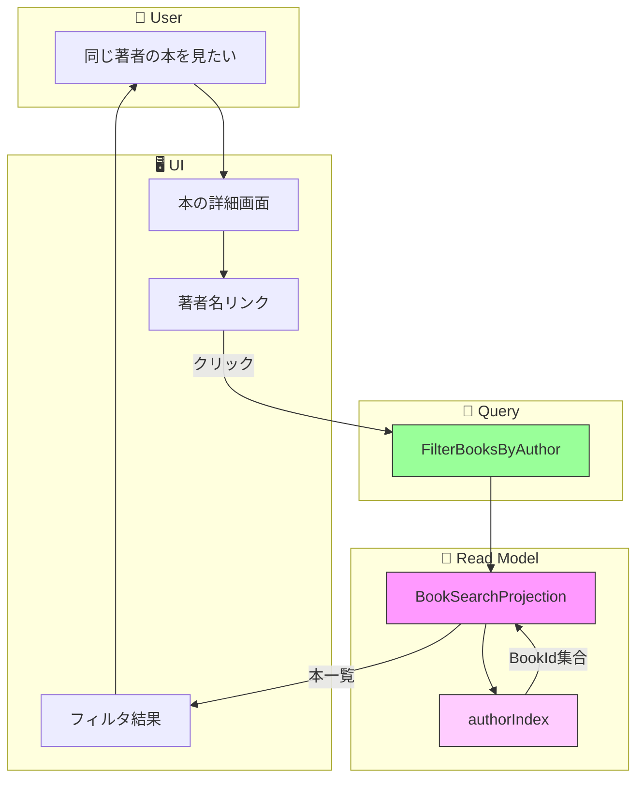

# イベントストーミング: 著者・出版社によるフィルタリング

**日付**: 2026-02-01
**参加者**:
- ユーザー（プロダクトオーナー）
- 田中博士（DDD専門家）
- 佐藤教授（データベース専門家）
- 鈴木氏（Scala専門家）
- 山田氏（分散システム専門家）

**スコープ**: 詳細画面から著者名・出版社をクリックして同じ著者・出版社の本を表示

---

## 1. ビッグピクチャー

### 1.1 ユーザーストーリー

> 「本の詳細画面で著者名をクリックして、同じ著者の他の本を見たい」
> 「出版社名をクリックして、同じ出版社の本を一覧表示したい」

### 1.2 要件（確定）

| 項目 | 決定 |
|------|------|
| マッチング方式 | 完全一致 |
| 一覧表示 | 不要（詳細画面からのクリックのみ） |
| 正規化 | 大文字小文字を区別しない |

---

## 2. 専門家ディスカッション

### 田中博士（DDD）: 機能の位置づけ

**分析**:
- タグフィルタリングと同様のパターン
- Write Sideには影響なし
- Read Model（Projection）のクエリ機能

**UI操作フロー**:
```
本の詳細画面
  ↓
著者名「Dean Wampler」をクリック
  ↓
同じ著者の本一覧を表示
  ↓
本を選択 → 詳細画面へ
```

**結論**: **クエリ機能の追加のみ**で対応。

### 佐藤教授（データベース）: インデックス設計

**フィルタリング効率化**:
```scala
// 著者インデックス
authorIndex: Map[NormalizedAuthor, Set[BookId]]

// 出版社インデックス
publisherIndex: Map[NormalizedPublisher, Set[BookId]]
```

**正規化ルール**:
- 大文字→小文字に統一
- 前後の空白をトリム
- 連続空白を単一空白に

```scala
def normalizeAuthor(author: String): String =
  author.trim.toLowerCase.replaceAll("\\s+", " ")

// 例: "Dean  Wampler " → "dean wampler"
```

### 鈴木氏（Scala）: 型設計

```scala
// 正規化された著者名
opaque type NormalizedAuthor <: String = String
object NormalizedAuthor:
  def apply(author: String): NormalizedAuthor =
    author.trim.toLowerCase.replaceAll("\\s+", " ")

// 正規化された出版社名
opaque type NormalizedPublisher <: String = String
object NormalizedPublisher:
  def apply(publisher: String): NormalizedPublisher =
    publisher.trim.toLowerCase.replaceAll("\\s+", " ")

// フィルタクエリ
enum MetadataFilter:
  case ByAuthor(author: NormalizedAuthor)
  case ByPublisher(publisher: NormalizedPublisher)
```

### 山田氏（分散システム）: 整合性

**考慮点**:
- 著者/出版社はBookMetadataの一部
- BookMetadataUpdatedイベント発生時にインデックス更新
- 結果整合性は個人利用で許容範囲

---

## 3. 設計決定

### 3.1 フィルタリングの流れ

```
┌─────────────────────────────────────────────────────┐
│                  本の詳細画面                        │
│                                                     │
│  タイトル: プログラミングScala                       │
│  著者: [Dean Wampler] ← クリック可能                │
│  出版社: [オライリー・ジャパン] ← クリック可能       │
│                                                     │
└─────────────────────────────────────────────────────┘
                          │
                          ▼ クリック
┌─────────────────────────────────────────────────────┐
│        Dean Wampler の本 (3冊)                      │
│                                                     │
│  ・プログラミングScala                              │
│  ・Scala関数型デザイン&プログラミング                │
│  ・Programming Scala, 2nd Edition                  │
│                                                     │
└─────────────────────────────────────────────────────┘
```

### 3.2 タグフィルタとの違い

| 項目 | タグフィルタ | 著者/出版社フィルタ |
|------|------------|-------------------|
| 複数選択 | AND/OR対応 | 単一のみ |
| 一覧画面 | タグ一覧あり | なし |
| 入力方式 | チェックボックス | リンククリック |
| 正規化 | 完全正規化 | 大文字小文字のみ |

### 3.3 APIパラメータ

既存の本一覧APIにフィルタパラメータを追加:

```
GET /api/books?author=Dean%20Wampler
GET /api/books?publisher=オライリー・ジャパン
```

---

## 4. イベントストーミング結果

### 4.1 ドメインイベント（オレンジ付箋）

**新規イベントなし** - 参照のみ

### 4.2 コマンド（青付箋）

**新規コマンドなし** - 参照のみ

### 4.3 クエリ（緑付箋）

| クエリ名 | 入力 | 出力 | 状態 |
|---------|------|------|------|
| `FilterBooksByAuthor` | author | List[BookSummary] | **新規** |
| `FilterBooksByPublisher` | publisher | List[BookSummary] | **新規** |

### 4.4 Read Model

| 名前 | 変更内容 | 状態 |
|------|---------|------|
| `BookSearchProjection` | authorIndex, publisherIndex追加 | **拡張** |

---

## 5. フロー図



---

## 6. 実装設計

### 6.1 インデックス構造

```scala
class BookSearchProjection:
  // 既存
  private val books: Ref[IO, Map[BookId, SearchableBook]] = ...
  private val titleIndex: Ref[IO, Map[String, Set[BookId]]] = ...
  private val tagIndex: Ref[IO, Map[NormalizedTagName, Set[BookId]]] = ...

  // 追加
  private val authorIndex: Ref[IO, Map[NormalizedAuthor, Set[BookId]]] = ...
  private val publisherIndex: Ref[IO, Map[NormalizedPublisher, Set[BookId]]] = ...
```

### 6.2 イベントハンドリング

```scala
def handleEvent(event: BookEvent): IO[Unit] = event match
  // ... 既存のハンドラ ...

  case BookMetadataFetched(_, bookId, metadata, _, _, _) =>
    for
      _ <- updateAuthorIndex(bookId, metadata.author)
      _ <- updatePublisherIndex(bookId, metadata.publisher)
    yield ()

  case BookMetadataUpdated(_, bookId, oldMetadata, newMetadata, _, _) =>
    for
      _ <- removeFromAuthorIndex(bookId, oldMetadata.flatMap(_.author))
      _ <- removeFromPublisherIndex(bookId, oldMetadata.flatMap(_.publisher))
      _ <- updateAuthorIndex(bookId, newMetadata.author)
      _ <- updatePublisherIndex(bookId, newMetadata.publisher)
    yield ()

private def updateAuthorIndex(bookId: BookId, author: Option[NES]): IO[Unit] =
  author match
    case Some(a) =>
      val normalized = NormalizedAuthor(a)
      authorIndex.update { idx =>
        val current = idx.getOrElse(normalized, Set.empty)
        idx.updated(normalized, current + bookId)
      }
    case None => IO.unit
```

### 6.3 フィルタリングロジック

```scala
def filterByAuthor(author: String): IO[List[BookSummary]] =
  val normalized = NormalizedAuthor(author)
  for
    idx <- authorIndex.get
    allBooks <- books.get
    bookIds = idx.getOrElse(normalized, Set.empty)
    result = bookIds.toList.flatMap(id => allBooks.get(id))
  yield result.sortBy(_.title.toLowerCase)

def filterByPublisher(publisher: String): IO[List[BookSummary]] =
  val normalized = NormalizedPublisher(publisher)
  for
    idx <- publisherIndex.get
    allBooks <- books.get
    bookIds = idx.getOrElse(normalized, Set.empty)
    result = bookIds.toList.flatMap(id => allBooks.get(id))
  yield result.sortBy(_.title.toLowerCase)
```

---

## 7. API設計

### 7.1 著者でフィルタリング

```
GET /api/books?author=Dean%20Wampler&sort=title&order=asc

Response 200:
{
  "books": [
    {
      "id": "01ARZ3NDEKTSV4RRFFQ69G5FAV",
      "title": "Programming Scala, 2nd Edition",
      "author": "Dean Wampler",
      "location": "本棚A"
    },
    {
      "id": "01ARZ3NDEKTSV4RRFFQ69G5FAW",
      "title": "プログラミングScala",
      "author": "Dean Wampler",
      "location": "本棚A"
    }
  ],
  "total": 2,
  "filter": {
    "type": "author",
    "value": "Dean Wampler"
  }
}
```

### 7.2 出版社でフィルタリング

```
GET /api/books?publisher=オライリー・ジャパン

Response 200:
{
  "books": [...],
  "total": 15,
  "filter": {
    "type": "publisher",
    "value": "オライリー・ジャパン"
  }
}
```

### 7.3 詳細画面からのリンク生成

```
// フロントエンド側
<a href="/books?author=${encodeURIComponent(book.author)}">
  ${book.author}
</a>

<a href="/books?publisher=${encodeURIComponent(book.publisher)}">
  ${book.publisher}
</a>
```

---

## 8. 専門家最終コメント

### 田中博士（DDD）

> 著者・出版社フィルタはタグフィルタと同じパターンで実装できます。違いは「単一選択のみ」という点です。将来的に複数著者でのフィルタが必要になった場合は、タグフィルタと同様のAND/OR対応を追加できます。

### 佐藤教授（データベース）

> authorIndexとpublisherIndexは、BookMetadataイベントをトリガーに更新されます。完全一致検索なのでMap[String, Set[BookId]]で十分です。部分一致が必要になった場合はTrieやN-gram索引を検討してください。

### 鈴木氏（Scala）

> NormalizedAuthor/NormalizedPublisherをopaque typeとして定義することで、正規化済みの値であることを型レベルで保証できます。これにより、未正規化の値がインデックスに混入することを防げます。

### 山田氏（分散システム）

> メタデータ更新時のインデックス再構築は原子的である必要があります。古いエントリを削除してから新しいエントリを追加する順序で、一時的に検索結果から消えることがありますが、個人利用では問題ありません。

---

## 9. 実装タスク

### Phase 1: Read Model拡張
1. [ ] `NormalizedAuthor`, `NormalizedPublisher`型の作成
2. [ ] `BookSearchProjection`にauthorIndex追加
3. [ ] `BookSearchProjection`にpublisherIndex追加
4. [ ] BookMetadata*イベントのハンドラ追加

### Phase 2: クエリ実装
5. [ ] `filterByAuthor`の実装
6. [ ] `filterByPublisher`の実装

### Phase 3: API層
7. [ ] `/api/books`に`author`パラメータ追加
8. [ ] `/api/books`に`publisher`パラメータ追加

### Phase 4: テスト
9. [ ] 著者フィルタの単体テスト
10. [ ] 出版社フィルタの単体テスト
11. [ ] 正規化ロジックのテスト

---

## 10. 修正対象ファイル

| ファイル | 変更内容 |
|---------|---------|
| `domain/.../NormalizedMetadata.scala` | 新規（NormalizedAuthor, NormalizedPublisher） |
| `infrastructure/.../BookSearchProjection.scala` | authorIndex, publisherIndex追加 |
| `controller/.../BookEndpoints.scala` | author, publisherパラメータ追加 |

---

## 11. 著者・出版社フィルタリング イベントストーミング完了

### 成果物
- コマンド: 0個
- ドメインイベント: 0個
- クエリ: 2個（新規）
- Read Model拡張: authorIndex, publisherIndex

### 設計ポイント
- **詳細画面からのナビゲーション**: リンククリックでフィルタ
- **完全一致**: 正規化後の完全一致検索
- **単一選択**: 著者1名または出版社1社でフィルタ
- **タグフィルタと同パターン**: 転置インデックス使用

---

*イベントストーミング（著者・出版社フィルタリング）完了*
