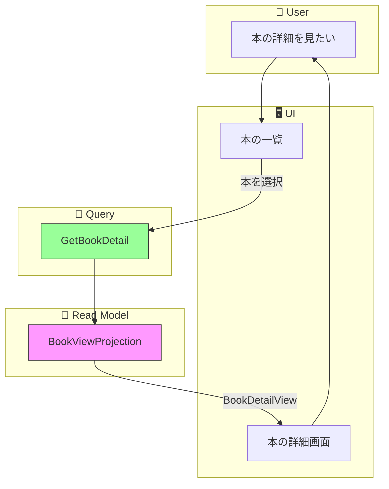

# イベントストーミング: 本の詳細表示

**日付**: 2026-02-01
**参加者**:
- ユーザー（プロダクトオーナー）
- 田中博士（DDD専門家）
- 佐藤教授（データベース専門家）
- 鈴木氏（Scala専門家）
- 山田氏（分散システム専門家）

**スコープ**: 1冊の本の詳細情報表示

---

## 1. ビッグピクチャー

### 1.1 ユーザーストーリー

> 「本を選択して、その本の詳細情報を確認したい」

### 1.2 要件（確定）

| 項目 | 表示内容 |
|------|---------|
| 基本情報 | タイトル、著者、出版社 |
| 管理情報 | タグ、保管場所、デバイス（現物/電子） |
| 識別情報 | ISBN/識別子、出版年 |
| システム情報 | 登録日、更新日 |

---

## 2. 専門家ディスカッション

### 田中博士（DDD）: 既存モデルとの整合性

**現在のBookView**:
```scala
final case class BookView(
  id: BookId,
  title: NES,
  identifier: Option[BookIdentifier],
  location: Option[Location],
  tags: Set[Tag],
  devices: Set[Device],
  isDeleted: Boolean,
  lastModified: Timestamp
)
```

**不足情報**:
- 著者（author）→ BookMetadata追加で対応予定
- 出版社（publisher）→ BookMetadata追加で対応予定
- 出版年（publishedYear）→ BookMetadata追加で対応予定
- 登録日（registeredAt）→ 追加が必要

**結論**: 既存のBookViewを拡張して`BookDetailView`を作成

### 佐藤教授（データベース）: データ取得

**取得パターン**:
```
1. IDで1件取得: O(1) - Map[BookId, BookDetailView]
2. 関連データの取得: なし（全情報が1つのビューに含まれる）
```

**結論**: 単純なKey-Value取得。最適化不要。

### 鈴木氏（Scala）: 詳細ビューの型設計

```scala
final case class BookDetailView(
  // 基本情報
  id: BookId,
  title: NES,
  author: Option[NES],
  publisher: Option[NES],

  // 識別情報
  identifier: Option[BookIdentifier],
  publishedYear: Option[Int],

  // 管理情報
  tags: Set[Tag],
  location: Option[Location],
  devices: Set[Device],

  // システム情報
  registeredAt: Timestamp,
  lastModifiedAt: Timestamp,

  // 状態
  isDeleted: Boolean
)
```

### 山田氏（分散システム）: 整合性

**考慮点**:
- 詳細表示はRead Modelからの取得
- 編集直後に表示すると古いデータが見える可能性（結果整合性）
- 個人利用では問題なし（数十ms〜数百msの遅延）

---

## 3. 設計決定

### 3.1 BookDetailView

```scala
final case class BookDetailView(
  // === 基本情報 ===
  id: BookId,
  title: NES,
  author: Option[NES],
  publisher: Option[NES],

  // === 識別情報 ===
  identifier: Option[BookIdentifier],
  identifierDisplay: String,  // 表示用（"ISBN: 978-4-xxx" など）
  publishedYear: Option[Int],

  // === 管理情報 ===
  tags: List[Tag],  // 順序保持（追加順）
  location: Option[Location],
  devices: Set[Device],

  // === システム情報 ===
  registeredAt: Timestamp,
  lastModifiedAt: Timestamp,

  // === 状態 ===
  isDeleted: Boolean
)
```

### 3.2 識別子の表示形式

| 識別子タイプ | 表示形式 |
|-------------|---------|
| ISBN | `ISBN: 978-4-87311-565-8` |
| arXiv | `arXiv: 2301.12345` |
| DOI | `DOI: 10.1038/nature12373` |
| Title | （表示なし、タイトルのみ） |

### 3.3 registeredAtの追加

現在のBookViewには登録日がないため、BookRegisteredイベントのタイムスタンプを保持する必要がある。

```scala
// BookViewProjectionの拡張
private def createViewFromEvent(event: BookEvent): BookView = event match
  case BookRegistered(_, bookId, identifier, title, _, timestamp) =>
    BookView(
      id = bookId,
      title = title,
      identifier = Some(identifier),
      registeredAt = timestamp,  // 追加
      // ...
    )
```

---

## 4. イベントストーミング結果

### 4.1 ドメインイベント（オレンジ付箋）

**新規イベントなし** - 詳細表示は既存データの参照のみ

### 4.2 コマンド（青付箋）

**新規コマンドなし** - 参照のみ

### 4.3 クエリ（緑付箋）

| クエリ名 | 入力 | 出力 | 状態 |
|---------|------|------|------|
| `GetBookDetail` | bookId | Option[BookDetailView] | **新規** |

### 4.4 Read Model

| 名前 | 変更内容 | 状態 |
|------|---------|------|
| `BookViewProjection` | registeredAt追加、BookDetailView対応 | **拡張** |

---

## 5. フロー図

### 5.1 詳細表示フロー



---

## 6. API設計

### 6.1 本の詳細取得エンドポイント

```
GET /api/books/{bookId}

Response 200:
{
  "id": "01ARZ3NDEKTSV4RRFFQ69G5FAV",
  "title": "プログラミングScala",
  "author": "Dean Wampler",
  "publisher": "オライリー・ジャパン",
  "identifier": {
    "type": "isbn",
    "value": "9784873119625"
  },
  "identifierDisplay": "ISBN: 978-4-87311-962-5",
  "publishedYear": 2021,
  "tags": [
    {"name": "programming"},
    {"name": "scala"}
  ],
  "location": {
    "name": "本棚A"
  },
  "devices": ["Ebook", "Paper"],
  "registeredAt": "2026-01-15T10:30:00Z",
  "lastModifiedAt": "2026-01-20T14:00:00Z"
}

Response 404:
{
  "error": "NOT_FOUND",
  "message": "Book not found: 01ARZ3NDEKTSV4RRFFQ69G5FAV"
}
```

### 6.2 詳細画面のUI構成案

```
┌─────────────────────────────────────────────────────┐
│ ← 戻る                              [編集] [削除]   │
├─────────────────────────────────────────────────────┤
│                                                     │
│  プログラミングScala                                │
│  ━━━━━━━━━━━━━━━━━━━━━━━━━━━━━━━                    │
│                                                     │
│  著者: Dean Wampler                                 │
│  出版社: オライリー・ジャパン                        │
│  出版年: 2021                                       │
│  ISBN: 978-4-87311-962-5                            │
│                                                     │
│  ───────────────────────────────────                │
│                                                     │
│  タグ: [programming] [scala] [+追加]                │
│                                                     │
│  場所: 本棚A                                        │
│  形態: 📖 現物  📱 電子書籍                          │
│                                                     │
│  ───────────────────────────────────                │
│                                                     │
│  登録日: 2026-01-15                                 │
│  更新日: 2026-01-20                                 │
│                                                     │
└─────────────────────────────────────────────────────┘
```

---

## 7. 専門家最終コメント

### 田中博士（DDD）

> 詳細表示は純粋なクエリ機能です。BookDetailViewは既存のBookViewを拡張したものであり、ドメインモデルへの変更は最小限です。registeredAtの追加のみが必要です。

### 佐藤教授（データベース）

> 単一レコードの取得はO(1)で、最適化の余地はありません。将来的に関連書籍（同じ著者、同じタグ）を表示する場合は、追加のクエリが必要になります。

### 鈴木氏（Scala）

> `BookDetailView`は`BookView`のスーパーセットとして設計できます。共通フィールドを持つトレイトを抽出することも可能ですが、現時点ではシンプルに別のcase classとして定義するのが適切です。

### 山田氏（分散システム）

> 詳細表示のレイテンシは数ms程度で、ユーザー体験に問題はありません。編集後の即時反映が必要な場合は、UIレベルでの楽観的更新を検討してください。

---

## 8. 実装タスク

### Phase 1: Read Model
1. [ ] `BookDetailView`の作成
2. [ ] `BookViewProjection`にregisteredAt追加
3. [ ] `GetBookDetail`クエリの実装

### Phase 2: API層
4. [ ] 詳細取得エンドポイント（GET /api/books/{bookId}）
5. [ ] 404エラーハンドリング

### Phase 3: テスト
6. [ ] BookDetailView取得の単体テスト
7. [ ] 存在しないIDの404テスト

---

## 9. 修正対象ファイル

| ファイル | 変更内容 |
|---------|---------|
| `domain/.../BookDetailView.scala` | 新規作成 |
| `domain/.../BookProjections.scala` | registeredAt追加、getDetail追加 |
| `controller/.../BookEndpoints.scala` | GET /api/books/{id}追加 |
| `controller/.../BookRoutes.scala` | ルート追加 |

---

## 10. 本の詳細表示 イベントストーミング完了

### 成果物
- コマンド: 0個
- ドメインイベント: 0個
- クエリ: 1個（新規）
- Read Model拡張: BookViewProjection（registeredAt追加）

### 表示項目
| カテゴリ | 項目 |
|---------|------|
| 基本情報 | タイトル、著者、出版社 |
| 識別情報 | ISBN/識別子、出版年 |
| 管理情報 | タグ、場所、デバイス |
| システム情報 | 登録日、更新日 |

### 設計ポイント
- **Read Model専用**: Write Sideに変更なし
- **既存拡張**: BookViewProjectionを拡張
- **registeredAt追加**: 登録日の永続化

---

*イベントストーミング（本の詳細表示）完了*
