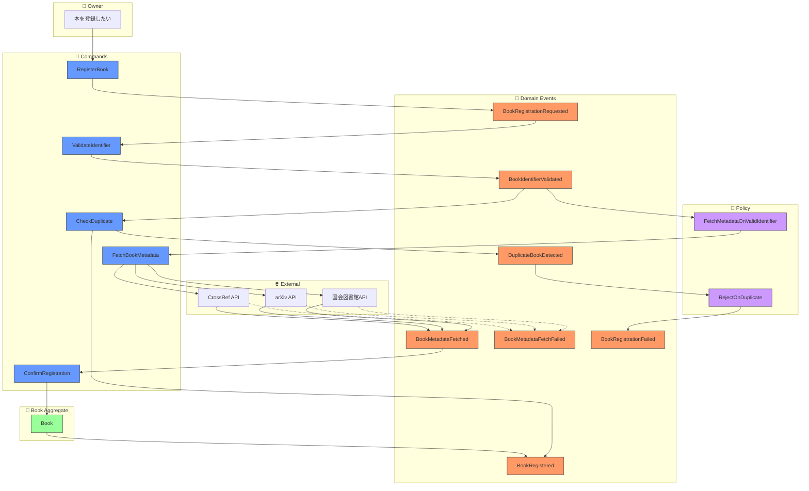
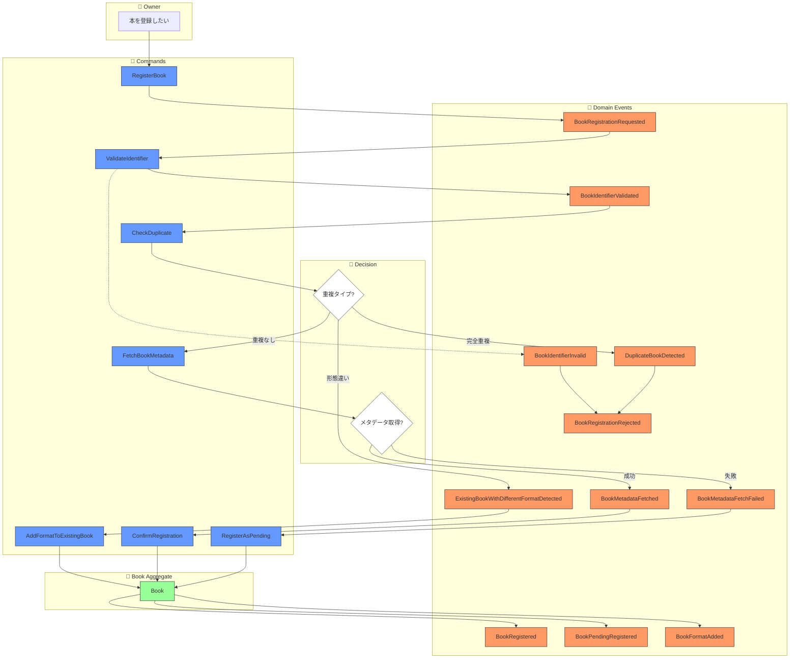
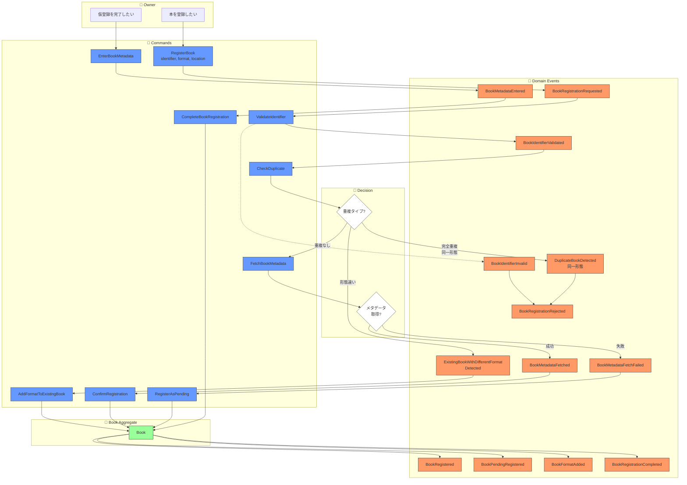
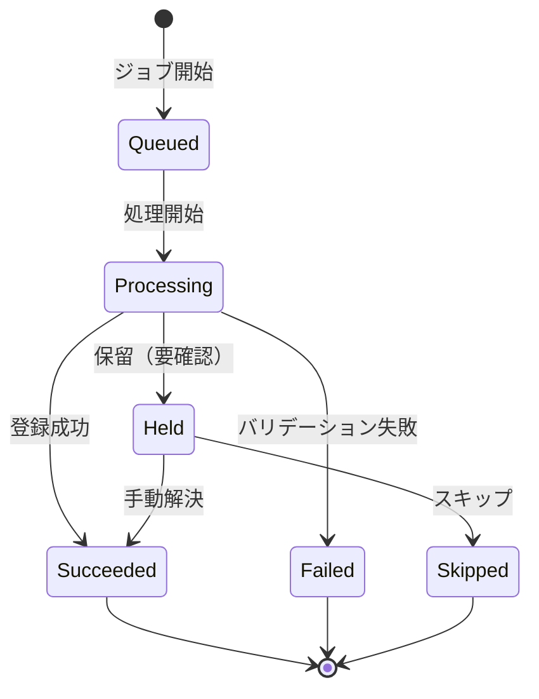
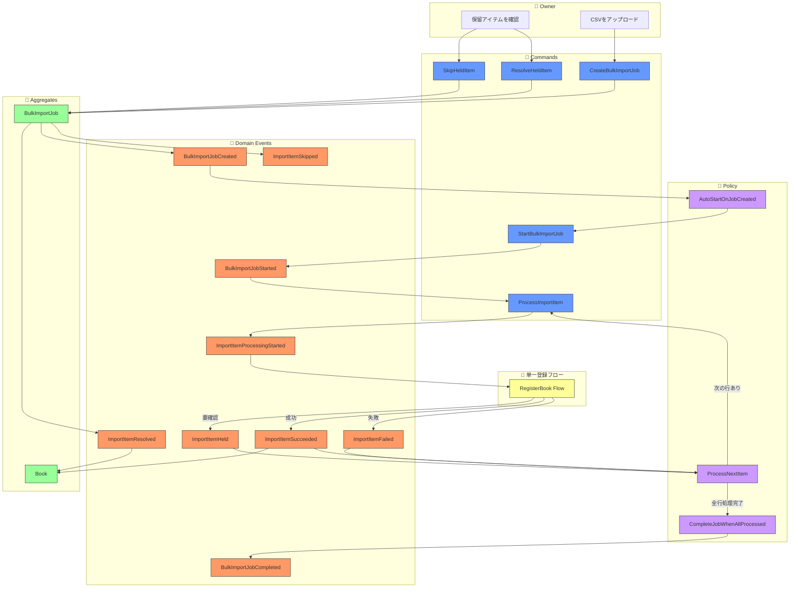
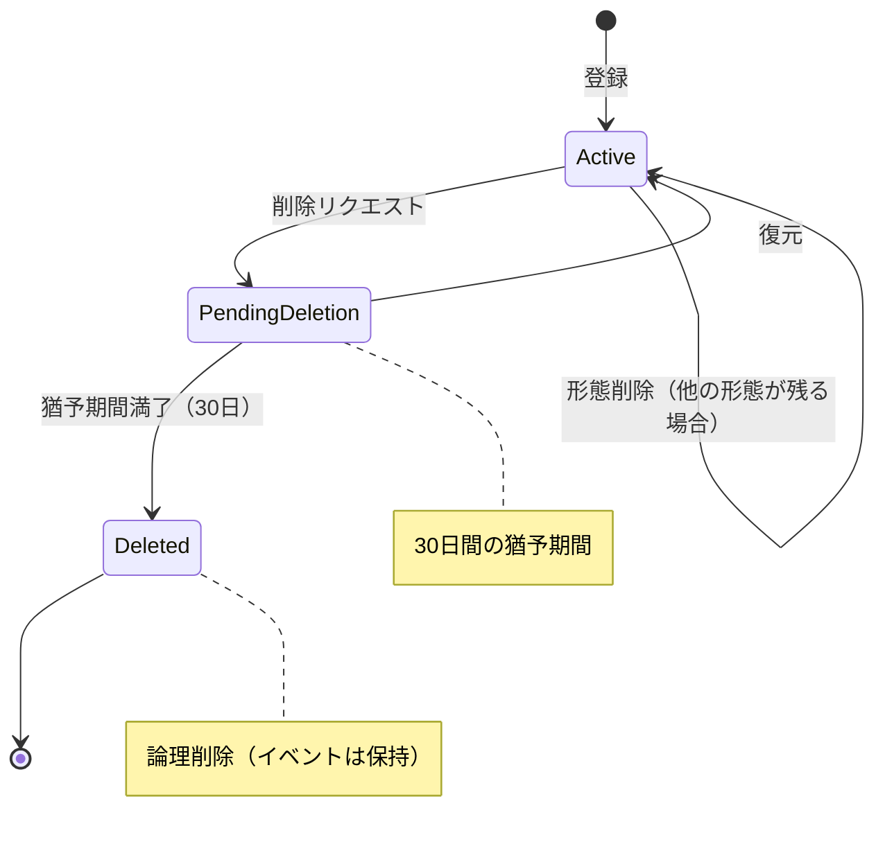
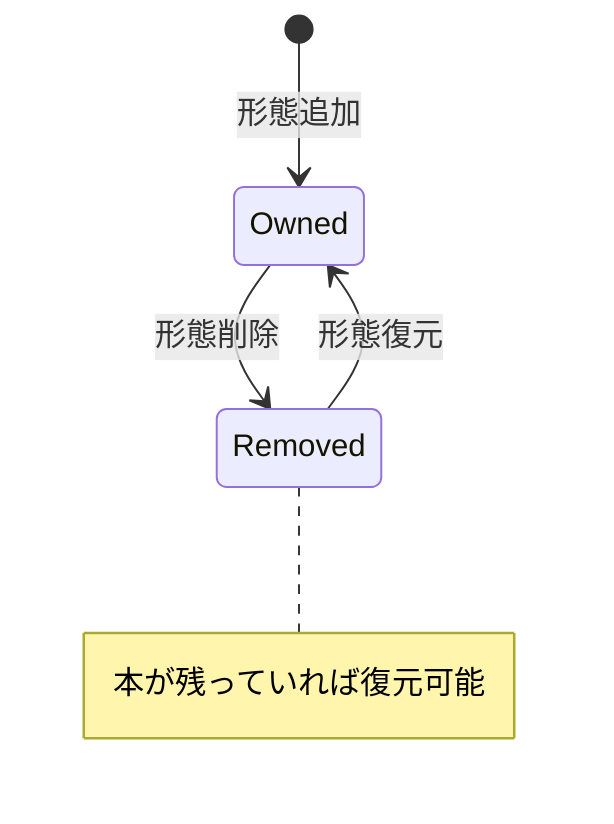
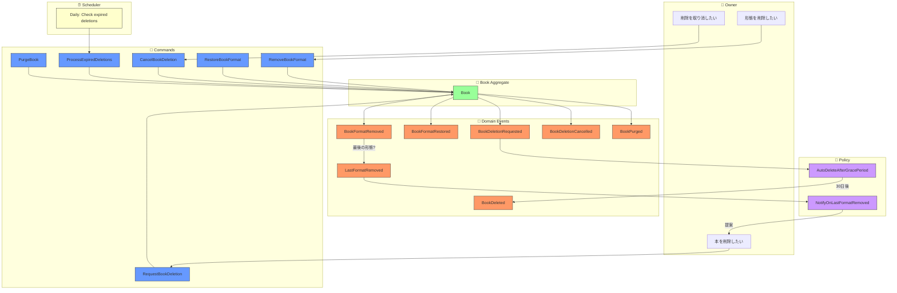

# イベントストーミング: 本の登録

**日付**: 2026-02-01
**参加者**:
- ユーザー（プロダクトオーナー）
- 田中博士（DDD専門家）
- 佐藤教授（データベース専門家）
- 鈴木氏（Scala専門家）
- 山田氏（分散システム専門家）

**スコープ**: 本1冊の登録フロー

---

## 1. ビッグピクチャー

### 1.1 ユーザーストーリー

> 「個人が所有している本を、現物・電子書籍の区別なく一意に管理したい」

---

## 2. イベントストーミング結果

### 2.1 ドメインイベント（オレンジ付箋）

| イベント名 | 説明 |
|-----------|------|
| `BookRegistrationRequested` | 本の登録がリクエストされた |
| `BookIdentifierValidated` | 識別子（ISBN/arXiv/DOI等）が検証された |
| `DuplicateBookDetected` | 重複する本が検出された |
| `BookMetadataFetched` | 外部APIから書誌情報が取得された |
| `BookMetadataFetchFailed` | 書誌情報の取得に失敗した |
| `BookRegistered` | 本が登録された |
| `BookRegistrationFailed` | 本の登録に失敗した |

### 2.2 コマンド（青付箋）

| コマンド名 | トリガー | 説明 |
|-----------|---------|------|
| `RegisterBook` | ユーザー | 本を登録する |
| `ValidateIdentifier` | システム | 識別子を検証する |
| `CheckDuplicate` | システム | 重複をチェックする |
| `FetchBookMetadata` | システム | 書誌情報を取得する |
| `ConfirmRegistration` | ユーザー | 登録を確定する |
| `CancelRegistration` | ユーザー | 登録をキャンセルする |

### 2.3 アクター（黄色付箋）

| アクター | 説明 |
|---------|------|
| `Owner` | 本の所有者（ユーザー） |
| `ExternalAPI` | 国会図書館、arXiv、CrossRef等 |

### 2.4 集約（黄緑付箋）

| 集約 | 責務 |
|-----|------|
| `Book` | 本のライフサイクル管理 |

### 2.5 ポリシー（紫付箋）

| ポリシー | トリガーイベント | 発行コマンド |
|---------|-----------------|-------------|
| `FetchMetadataOnValidIdentifier` | `BookIdentifierValidated` | `FetchBookMetadata` |
| `RejectOnDuplicate` | `DuplicateBookDetected` | - (登録失敗) |

---

## 3. プロセスフロー



---

## 4. 専門家ディスカッション

### 質問1: 登録フローは同期？非同期？

**山田氏（分散システム）**:
外部API呼び出しがあるため、2つのアプローチが考えられます：

1. **同期フロー**: ユーザーが待機、タイムアウトリスク
2. **非同期フロー**: 即座にACK、後からメタデータ更新

**田中博士（DDD）**:
ユーザー体験の観点では：
- ISBNスキャン → すぐに結果が欲しい
- でも外部APIは数秒かかることも

**提案**: **楽観的登録** + **後からメタデータ補完**

---

### 質問2: メタデータ取得失敗時の挙動は？

**佐藤教授（データベース）**:
選択肢：
1. 登録を失敗させる
2. タイトルのみで登録を許可する
3. 仮登録状態にする

**鈴木氏（Scala）**:
型で状態を表現するなら：

```scala
sealed trait BookRegistrationState
case class Pending(identifier: BookIdentifier) extends BookRegistrationState
case class Enriched(metadata: BookMetadata) extends BookRegistrationState
case class ManualEntry(title: NES) extends BookRegistrationState
```

---

## 5. ユーザー決定事項

| 質問 | 決定 |
|------|------|
| メタデータ取得失敗時 | **仮登録状態**にする（後で補完可能） |
| 重複検出時 | **フォーマット違いなら許可**（現物/電子書籍は別形態） |
| 現物/電子書籍の扱い | **同じ本の異なる形態**（1つのBookに複数の所有形態を紐づけ） |

---

## 6. 決定を反映した改訂版

### 6.1 新しい概念: BookFormat（所有形態）

```scala
enum BookFormat:
  case Physical      // 現物（紙）
  case Ebook         // 電子書籍
  case Audiobook     // オーディオブック
  case PDF           // PDF（自炊など）
```

### 6.2 改訂版ドメインイベント

| イベント名 | 説明 |
|-----------|------|
| `BookRegistrationRequested` | 本の登録がリクエストされた |
| `BookIdentifierValidated` | 識別子が検証された |
| `BookIdentifierInvalid` | 識別子が無効だった |
| `DuplicateBookDetected` | 完全に同じ本（同一形態）が検出された |
| `ExistingBookWithDifferentFormatDetected` | 同じ本の別形態が検出された |
| `BookMetadataFetched` | 書誌情報が取得された |
| `BookMetadataFetchFailed` | 書誌情報の取得に失敗した |
| `BookRegistered` | 本が登録された（メタデータあり） |
| `BookPendingRegistered` | 本が仮登録された（メタデータ未取得） |
| `BookFormatAdded` | 既存の本に新しい所有形態が追加された |
| `BookRegistrationRejected` | 登録が拒否された（完全重複） |

### 6.3 改訂版コマンド

| コマンド名 | トリガー | 説明 |
|-----------|---------|------|
| `RegisterBook` | ユーザー | 本を登録する |
| `ValidateIdentifier` | システム | 識別子を検証する |
| `CheckDuplicate` | システム | 重複をチェックする |
| `FetchBookMetadata` | システム | 書誌情報を取得する |
| `ConfirmRegistration` | ユーザー | 登録を確定する |
| `AddFormatToExistingBook` | ユーザー | 既存の本に形態を追加する |
| `RegisterAsPending` | システム | 仮登録として保存する |

### 6.4 改訂版フロー図



---

## 7. 専門家ディスカッション（続き）

### 田中博士（DDD）: 集約の再設計

決定を踏まえると、`Book`集約は以下の構造になります：

```
Book Aggregate
├── BookId (識別子)
├── BookIdentifier (ISBN/arXiv/DOI/Title)
├── Metadata (タイトル、著者、出版社...)
├── Formats: Set[OwnedFormat]  ← 新規追加
│   ├── OwnedFormat(Physical, acquiredAt, location)
│   ├── OwnedFormat(Ebook, acquiredAt, platform)
│   └── ...
└── Status (Registered | Pending)
```

### 佐藤教授（データベース）: 一意性制約の再考

重複チェックのキーは：
- `(NormalizedIdentifier, Format)` の組み合わせで一意
- 同じISBNでも `Physical` と `Ebook` は別エントリ可能

### 鈴木氏（Scala）: 状態遷移の型表現

```scala
sealed trait BookState
case class Pending(identifier: BookIdentifier, format: BookFormat) extends BookState
case class Registered(metadata: BookMetadata, formats: NonEmptySet[OwnedFormat]) extends BookState
```

### 山田氏（分散システム）: イベントの順序保証

仮登録 → 本登録の遷移は、同一集約内なので順序保証あり。

---

## 8. ユーザー決定事項（追加）

| 質問 | 決定 |
|------|------|
| 所有形態の属性 | **形態 + 保管場所**（現物:本棚名、電子:プラットフォーム名） |
| 仮登録の完了方法 | **手動でメタデータ入力** |

---

## 9. OwnedFormat 詳細設計

### 9.1 構造

```scala
final case class OwnedFormat(
  format: BookFormat,        // Physical | Ebook | Audiobook | PDF
  location: StorageLocation  // 保管場所
)

sealed trait StorageLocation
object StorageLocation:
  // 現物用
  final case class Bookshelf(name: NES) extends StorageLocation        // "リビング本棚"
  final case class Lent(to: NES) extends StorageLocation               // "田中さんに貸出中"

  // 電子書籍用
  final case class Platform(name: NES) extends StorageLocation         // "Kindle", "Kobo"
  final case class LocalStorage(path: NES) extends StorageLocation     // "/Documents/Books/"
```

### 9.2 追加イベント・コマンド

| コマンド | 説明 |
|---------|------|
| `EnterBookMetadata` | 仮登録の本にメタデータを手入力 |
| `CompleteBookRegistration` | 仮登録を完了 |

| イベント | 説明 |
|---------|------|
| `BookMetadataEntered` | メタデータが手入力された |
| `BookRegistrationCompleted` | 仮登録が完了し正式登録になった |

---

## 10. 完全版フロー図



---

## 11. イベント・コマンド完全リスト

### コマンド（青）

| # | コマンド | アクター | 入力 |
|---|---------|---------|------|
| 1 | `RegisterBook` | Owner | identifier, format, location |
| 2 | `ValidateIdentifier` | System | identifier |
| 3 | `CheckDuplicate` | System | normalizedIdentifier, format |
| 4 | `FetchBookMetadata` | System | identifier |
| 5 | `ConfirmRegistration` | System | bookId, metadata, format, location |
| 6 | `AddFormatToExistingBook` | Owner | bookId, format, location |
| 7 | `RegisterAsPending` | System | bookId, identifier, format, location |
| 8 | `EnterBookMetadata` | Owner | bookId, title, author?, publisher? |
| 9 | `CompleteBookRegistration` | Owner | bookId |

### ドメインイベント（オレンジ）

| # | イベント | トリガー |
|---|---------|---------|
| 1 | `BookRegistrationRequested` | RegisterBook |
| 2 | `BookIdentifierValidated` | ValidateIdentifier |
| 3 | `BookIdentifierInvalid` | ValidateIdentifier |
| 4 | `DuplicateBookDetected` | CheckDuplicate |
| 5 | `ExistingBookWithDifferentFormatDetected` | CheckDuplicate |
| 6 | `BookMetadataFetched` | FetchBookMetadata |
| 7 | `BookMetadataFetchFailed` | FetchBookMetadata |
| 8 | `BookRegistered` | ConfirmRegistration |
| 9 | `BookPendingRegistered` | RegisterAsPending |
| 10 | `BookFormatAdded` | AddFormatToExistingBook |
| 11 | `BookRegistrationRejected` | - (重複検出時) |
| 12 | `BookMetadataEntered` | EnterBookMetadata |
| 13 | `BookRegistrationCompleted` | CompleteBookRegistration |

---

## 12. 専門家コメント

### 田中博士（DDD）: 集約の最終形

```
Book Aggregate
├── BookId: BookId
├── Identifier: BookIdentifier
├── Status: Pending | Registered
├── Metadata: Option[BookMetadata]
│   ├── title: NES
│   ├── authors: List[Author]
│   ├── publisher: Option[NES]
│   └── publishedDate: Option[Date]
├── Formats: NonEmptySet[OwnedFormat]
│   └── OwnedFormat
│       ├── format: BookFormat
│       └── location: StorageLocation
└── CreatedAt: Timestamp
```

### 佐藤教授（データベース）: インデックス設計

```
Primary Key:   BookId
Index 1:       NormalizedIdentifier → BookId（重複チェック用）
Index 2:       (NormalizedIdentifier, Format) → BookId（形態込み重複チェック）
Index 3:       Status = Pending（仮登録一覧用）
```

### 鈴木氏（Scala）: 状態遷移

```scala
// 状態遷移は型で強制
Book[Pending].completeRegistration(metadata) → Book[Registered]
Book[Registered].addFormat(format) → Book[Registered]
```

### 山田氏（分散システム）: イベント順序

登録フローは単一集約内で完結するため、イベント順序は自然に保証される。

---

## 13. 本の登録イベントストーミング完了

### 成果物
- コマンド: 9個
- ドメインイベント: 13個
- 集約: 1個（Book）
- 値オブジェクト: BookFormat, OwnedFormat, StorageLocation

### 次のトピック候補
1. 本の検索・閲覧フロー
2. 本の貸出・返却フロー
3. タグ・カテゴリ管理フロー
4. 本の削除フロー

---

*イベントストーミング（本の登録）完了*

---

# イベントストーミング: 本の複数登録（バルク登録）

**スコープ**: CSV等のリストからの一括登録

---

## 1. ユーザーストーリー

> 「CSVファイルで管理している蔵書リストを一括でシステムに取り込みたい」

---

## 2. 専門家ディスカッション: 初期分析

### 山田氏（分散システム）: バルク処理の課題

単一登録との違い：
1. **部分的失敗**: 100冊中5冊が失敗したらどうする？
2. **進捗追跡**: 長時間処理の進捗をどう伝える？
3. **トランザクション境界**: 全体を1トランザクション？個別？
4. **リソース制御**: 外部API呼び出しのレート制限

### 田中博士（DDD）: 集約境界の問題

```
❌ 悪い設計: BulkImport集約が全書籍を管理
   → 巨大な集約、競合状態

✅ 良い設計: BulkImportJob + 個別のBook集約
   → ジョブは進捗管理のみ、各Bookは独立
```

### 佐藤教授（データベース）: 入力フォーマット

CSVの想定カラム：
```csv
identifier_type,identifier,format,location,title
isbn,9784873115658,physical,リビング本棚,
arxiv,2301.12345,pdf,/Documents/,
doi,10.1038/nature12373,ebook,Kindle,
,,,本棚A,手書きノート
```

- 識別子がある行 → 自動でメタデータ取得を試行
- 識別子がない行 → タイトル必須、仮登録として扱う

---

## 3. ユーザー決定事項

| 質問 | 決定 |
|------|------|
| 部分失敗時 | **失敗行を保留して続行**（後で手動修正可能） |
| 処理方式 | **非同期（バックグラウンド）** |
| 重複時のデフォルト | **形態追加を試みる**（単一登録と同じロジック） |

---

## 4. ドメインモデル: BulkImportJob

### 4.1 集約設計

```
BulkImportJob Aggregate（ジョブ管理専用）
├── JobId: BulkImportJobId
├── Status: Pending | Processing | Completed | Failed
├── Progress: ImportProgress
│   ├── total: Int
│   ├── processed: Int
│   ├── succeeded: Int
│   ├── failed: Int
│   └── pending: Int（保留）
├── Items: List[ImportItem]
│   └── ImportItem
│       ├── rowNumber: Int
│       ├── status: ItemStatus
│       ├── input: ImportInput
│       └── result: Option[ImportResult]
├── CreatedAt: Timestamp
└── CompletedAt: Option[Timestamp]
```

### 4.2 ImportItem の状態遷移



---

## 5. イベントストーミング結果

### 5.1 ドメインイベント（オレンジ）

| イベント名 | 説明 |
|-----------|------|
| `BulkImportJobCreated` | バルクインポートジョブが作成された |
| `BulkImportJobStarted` | ジョブの処理が開始された |
| `ImportItemProcessingStarted` | 1件の処理が開始された |
| `ImportItemSucceeded` | 1件の登録が成功した |
| `ImportItemFailed` | 1件の登録が失敗した（バリデーションエラー等） |
| `ImportItemHeld` | 1件が保留された（要確認） |
| `ImportItemResolved` | 保留アイテムが解決された |
| `ImportItemSkipped` | 保留アイテムがスキップされた |
| `BulkImportJobCompleted` | ジョブが完了した |
| `BulkImportJobFailed` | ジョブ全体が失敗した（致命的エラー） |

### 5.2 コマンド（青）

| コマンド名 | トリガー | 説明 |
|-----------|---------|------|
| `CreateBulkImportJob` | Owner | CSVをアップロードしてジョブ作成 |
| `StartBulkImportJob` | System | ジョブの処理を開始 |
| `ProcessImportItem` | System | 1件を処理（内部で単一登録を呼び出し） |
| `ResolveHeldItem` | Owner | 保留アイテムを手動で解決 |
| `SkipHeldItem` | Owner | 保留アイテムをスキップ |
| `CancelBulkImportJob` | Owner | ジョブをキャンセル |
| `RetryFailedItems` | Owner | 失敗したアイテムを再試行 |

### 5.3 ポリシー（紫）

| ポリシー | トリガーイベント | 発行コマンド |
|---------|-----------------|-------------|
| `AutoStartOnJobCreated` | `BulkImportJobCreated` | `StartBulkImportJob` |
| `ProcessNextItem` | `ImportItemSucceeded/Failed/Held` | `ProcessImportItem`（次の行） |
| `CompleteJobWhenAllProcessed` | 全アイテム処理完了 | - (ジョブ完了) |

---

## 6. 保留（Held）となるケース

| ケース | 理由 | 解決方法 |
|--------|------|---------|
| 形態追加で既存本が見つかった | 確認が必要 | 承認 or スキップ |
| メタデータ取得失敗 | タイトル不明 | 手動入力 or スキップ |
| 識別子フォーマット不正 | パース失敗 | 修正して再試行 or スキップ |
| CSV行の必須項目欠落 | バリデーション失敗 | 修正して再試行 or スキップ |

---

## 7. 完全版フロー図



---

## 8. CSVフォーマット仕様

```csv
identifier_type,identifier,format,location,title,on_duplicate
isbn,9784873115658,physical,リビング本棚,,add_format
arxiv,2301.12345,pdf,/Documents/Papers/,,skip
doi,10.1038/nature12373,ebook,Kindle,,add_format
,,,本棚A,手書きノート,
isbn,9784873115658,ebook,Kindle,,add_format
```

| カラム | 必須 | 説明 |
|--------|------|------|
| `identifier_type` | △ | isbn, arxiv, doi, 空欄 |
| `identifier` | △ | 識別子の値 |
| `format` | ✓ | physical, ebook, audiobook, pdf |
| `location` | ✓ | 保管場所 |
| `title` | △ | 識別子がない場合は必須 |
| `on_duplicate` | - | add_format（デフォルト）, skip, fail |

---

## 9. 専門家コメント

### 田中博士（DDD）: 集約間の関係

```
BulkImportJob ─────processes────→ Book（複数）
     │
     └── 各ImportItemが1つのBookに対応
         ただし、Book集約は独立して存在
```

`BulkImportJob`は「ジョブの進捗管理」のみを担当。
実際の本の登録は`Book`集約が担当（単一登録と同じ）。

### 佐藤教授（データベース）: 進捗の永続化

```sql
-- ジョブテーブル
bulk_import_jobs (job_id, status, total, succeeded, failed, held, created_at, completed_at)

-- アイテムテーブル
import_items (job_id, row_number, status, input_json, result_json, book_id)
```

### 鈴木氏（Scala）: 型設計

```scala
enum ImportItemStatus:
  case Queued
  case Processing
  case Succeeded(bookId: BookId, action: ImportAction)
  case Failed(error: ImportError)
  case Held(reason: HoldReason)
  case Skipped

enum ImportAction:
  case Created           // 新規登録
  case FormatAdded       // 形態追加
  case CompletedPending  // 仮登録完了

enum HoldReason:
  case DuplicateNeedsConfirmation(existingBookId: BookId)
  case MetadataFetchFailed(identifier: BookIdentifier)
  case ValidationError(errors: NonEmptyList[String])
```

### 山田氏（分散システム）: 並行処理

外部API呼び出しのレート制限を考慮：
- 同時処理数を制限（例: 5並列）
- 失敗時は指数バックオフでリトライ
- ジョブ全体のタイムアウト設定

```scala
val parallelism = 5
val itemStream: fs2.Stream[IO, ImportItem] = ...
itemStream
  .parEvalMap(parallelism)(processItem)
  .through(updateProgress)
```

---

## 10. イベント・コマンド完全リスト（バルク登録）

### コマンド（青）

| # | コマンド | アクター | 入力 |
|---|---------|---------|------|
| 1 | `CreateBulkImportJob` | Owner | csvData: CsvContent |
| 2 | `StartBulkImportJob` | System | jobId |
| 3 | `ProcessImportItem` | System | jobId, rowNumber |
| 4 | `ResolveHeldItem` | Owner | jobId, rowNumber, resolution |
| 5 | `SkipHeldItem` | Owner | jobId, rowNumber |
| 6 | `CancelBulkImportJob` | Owner | jobId |
| 7 | `RetryFailedItems` | Owner | jobId |

### ドメインイベント（オレンジ）

| # | イベント | 集約 |
|---|---------|------|
| 1 | `BulkImportJobCreated` | BulkImportJob |
| 2 | `BulkImportJobStarted` | BulkImportJob |
| 3 | `ImportItemProcessingStarted` | BulkImportJob |
| 4 | `ImportItemSucceeded` | BulkImportJob |
| 5 | `ImportItemFailed` | BulkImportJob |
| 6 | `ImportItemHeld` | BulkImportJob |
| 7 | `ImportItemResolved` | BulkImportJob |
| 8 | `ImportItemSkipped` | BulkImportJob |
| 9 | `BulkImportJobCompleted` | BulkImportJob |
| 10 | `BulkImportJobFailed` | BulkImportJob |
| 11 | `BulkImportJobCancelled` | BulkImportJob |

---

## 11. 本の複数登録イベントストーミング完了

### 成果物
- 新規集約: 1個（BulkImportJob）
- コマンド: 7個
- ドメインイベント: 11個
- 値オブジェクト: ImportItem, ImportItemStatus, ImportProgress

### 単一登録との関係
- バルク登録は内部で単一登録フローを呼び出す
- 重複検出・形態追加のロジックは共通

---

*イベントストーミング（本の複数登録）完了*

---

# イベントストーミング: 本の削除

**スコープ**: 登録済みの本の削除フロー

---

## 1. ユーザーストーリー

> 「手放した本や誤って登録した本をシステムから削除したい」

---

## 2. 専門家ディスカッション: 初期分析

### 田中博士（DDD）: 削除の種類

削除には複数のレベルがあります：

```
レベル1: 形態の削除
  └── 「Kindle版は売ったけど紙は持ってる」

レベル2: 本全体の削除
  └── 「この本はもう持っていない」

レベル3: 完全削除（物理削除）
  └── 「履歴も含めて消したい」
```

### 佐藤教授（データベース）: 論理削除 vs 物理削除

| 方式 | メリット | デメリット |
|------|---------|-----------|
| 論理削除 | 復元可能、監査証跡 | データ肥大化 |
| 物理削除 | データクリーン | 復元不可 |

**イベントソーシングでは論理削除が自然**（イベントは不変）

### 鈴木氏（Scala）: 状態遷移

```scala
enum BookStatus:
  case Active                    // 通常
  case Archived                  // アーカイブ（非表示だが復元可能）
  case PendingDeletion           // 削除予定（猶予期間）
  case Deleted                   // 削除済み（論理削除）
```

### 山田氏（分散システム）: 削除の整合性

関連データの扱い：
- タグ付け → 削除時に解除？
- 貸出中 → 削除を拒否？
- バルクインポートの参照 → 履歴として保持

---

## 3. ユーザー決定事項

| 質問 | 決定 |
|------|------|
| 削除の粒度 | **両方可能**（形態単位でも本全体でも削除可能） |
| 復元機能 | **猶予期間あり**（30日後に完全削除、それまでは復元可能） |
| 確認プロセス | **ドメインは関与しない**（UIの責務） |

---

## 4. 状態遷移モデル

### 4.1 本の状態



### 4.2 形態の状態



---

## 5. イベントストーミング結果

### 5.1 ドメインイベント（オレンジ）

| イベント名 | 説明 |
|-----------|------|
| **形態レベル** | |
| `BookFormatRemoved` | 所有形態が削除された |
| `BookFormatRestored` | 削除された形態が復元された |
| **本レベル** | |
| `BookDeletionRequested` | 本の削除がリクエストされた（猶予期間開始） |
| `BookDeletionCancelled` | 本の削除がキャンセルされた（復元） |
| `BookDeleted` | 本が削除された（猶予期間満了） |
| `BookPurged` | 本が完全削除された（物理削除オプション） |
| **自動イベント** | |
| `LastFormatRemoved` | 最後の形態が削除された → 本削除を提案 |

### 5.2 コマンド（青）

| コマンド名 | トリガー | 説明 |
|-----------|---------|------|
| **形態レベル** | |
| `RemoveBookFormat` | Owner | 特定の形態を削除 |
| `RestoreBookFormat` | Owner | 削除された形態を復元 |
| **本レベル** | |
| `RequestBookDeletion` | Owner | 本の削除をリクエスト（猶予期間開始） |
| `CancelBookDeletion` | Owner | 削除をキャンセル（復元） |
| `PurgeBook` | Owner/System | 完全削除（物理削除、オプション） |
| **システム** | |
| `ProcessExpiredDeletions` | Scheduler | 猶予期間満了の本を削除 |

### 5.3 ポリシー（紫）

| ポリシー | トリガーイベント | アクション |
|---------|-----------------|------------|
| `NotifyOnLastFormatRemoved` | `LastFormatRemoved` | 「本全体を削除しますか？」と提案 |
| `AutoDeleteAfterGracePeriod` | 30日経過 | `BookDeleted` を発行 |
| `CascadeDeleteFormats` | `BookDeletionRequested` | 全形態を PendingDeletion に |

---

## 6. 削除シナリオ

### シナリオ1: 形態のみ削除

```
所有状態: Physical + Ebook
   ↓
RemoveBookFormat(Ebook)
   ↓
BookFormatRemoved(Ebook)
   ↓
所有状態: Physical のみ
```

### シナリオ2: 最後の形態を削除

```
所有状態: Physical のみ
   ↓
RemoveBookFormat(Physical)
   ↓
BookFormatRemoved(Physical)
   ↓
LastFormatRemoved  ← システムが検知
   ↓
（UI）「本全体を削除しますか？」
   ↓
RequestBookDeletion（ユーザーが選択した場合）
```

### シナリオ3: 本全体を削除

```
RequestBookDeletion
   ↓
BookDeletionRequested (猶予期間開始)
   ↓
[30日間: 復元可能]
   ↓
ProcessExpiredDeletions (Scheduler)
   ↓
BookDeleted (論理削除完了)
```

### シナリオ4: 削除の復元

```
状態: PendingDeletion (削除予定)
   ↓
CancelBookDeletion
   ↓
BookDeletionCancelled
   ↓
状態: Active (復元完了)
```

---

## 7. 完全版フロー図



---

## 8. 専門家コメント

### 田中博士（DDD）: 集約の不変条件

```scala
// Book集約の不変条件
require(
  status != Active || formats.nonEmpty,
  "Active状態の本は少なくとも1つの形態を持つ必要がある"
)

// 最後の形態削除時の選択肢
def removeFormat(format: BookFormat): Either[LastFormatWarning, Book] =
  if formats.size == 1 && formats.contains(format) then
    Left(LastFormatWarning(this))  // 本削除を提案
  else
    Right(copy(formats = formats - format))
```

### 佐藤教授（データベース）: 削除インデックス

```sql
-- 削除予定の本を効率的に検索
CREATE INDEX idx_pending_deletion
ON books (scheduled_deletion_at)
WHERE status = 'PendingDeletion';

-- 日次バッチで猶予期間満了をチェック
SELECT book_id FROM books
WHERE status = 'PendingDeletion'
  AND scheduled_deletion_at <= NOW();
```

### 鈴木氏（Scala）: 型安全な状態表現

```scala
sealed trait BookState
object BookState:
  final case class Active(formats: NonEmptySet[OwnedFormat]) extends BookState
  final case class PendingDeletion(
    previousFormats: NonEmptySet[OwnedFormat],
    requestedAt: Timestamp,
    scheduledAt: Timestamp  // requestedAt + 30日
  ) extends BookState
  case object Deleted extends BookState

// 状態遷移を型で強制
def requestDeletion(book: Book[Active]): Book[PendingDeletion]
def cancelDeletion(book: Book[PendingDeletion]): Book[Active]
def confirmDeletion(book: Book[PendingDeletion]): Book[Deleted]
```

### 山田氏（分散システム）: スケジューラ設計

```scala
// 日次バッチ（深夜実行）
val deletionScheduler: fs2.Stream[IO, Unit] =
  fs2.Stream
    .awakeEvery[IO](24.hours)
    .evalMap(_ => processExpiredDeletions)

def processExpiredDeletions: IO[Int] =
  for
    expired <- repository.findExpiredPendingDeletions()
    _       <- expired.traverse(book => commandHandler.handle(ConfirmDeletion(book.id)))
  yield expired.size
```

---

## 9. イベント・コマンド完全リスト（削除）

### コマンド（青）

| # | コマンド | アクター | 入力 |
|---|---------|---------|------|
| 1 | `RemoveBookFormat` | Owner | bookId, format |
| 2 | `RestoreBookFormat` | Owner | bookId, format |
| 3 | `RequestBookDeletion` | Owner | bookId |
| 4 | `CancelBookDeletion` | Owner | bookId |
| 5 | `ProcessExpiredDeletions` | Scheduler | - |
| 6 | `PurgeBook` | Owner/Admin | bookId |

### ドメインイベント（オレンジ）

| # | イベント | 説明 |
|---|---------|------|
| 1 | `BookFormatRemoved` | 形態が削除された |
| 2 | `BookFormatRestored` | 形態が復元された |
| 3 | `LastFormatRemoved` | 最後の形態が削除された |
| 4 | `BookDeletionRequested` | 本の削除がリクエストされた |
| 5 | `BookDeletionCancelled` | 削除がキャンセルされた |
| 6 | `BookDeleted` | 本が削除された（論理削除） |
| 7 | `BookPurged` | 本が完全削除された（物理削除） |

---

## 10. 本の削除イベントストーミング完了

### 成果物
- コマンド: 6個
- ドメインイベント: 7個
- 新しい状態: PendingDeletion, Deleted
- スケジューラ: 日次バッチで猶予期間満了チェック

### 設計ポイント
- **形態単位 + 本全体**の両方の削除をサポート
- **30日間の猶予期間**で誤削除を防止
- **最後の形態削除時**は本削除を提案
- ドメインは確認UIに関与しない

---

*イベントストーミング（本の削除）完了*
