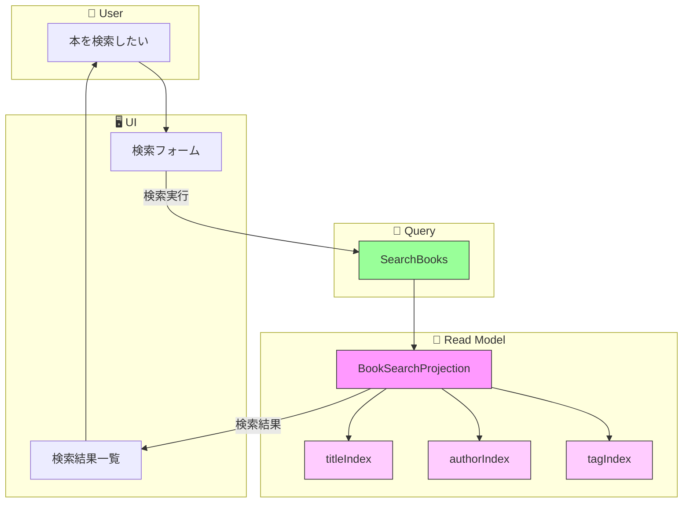
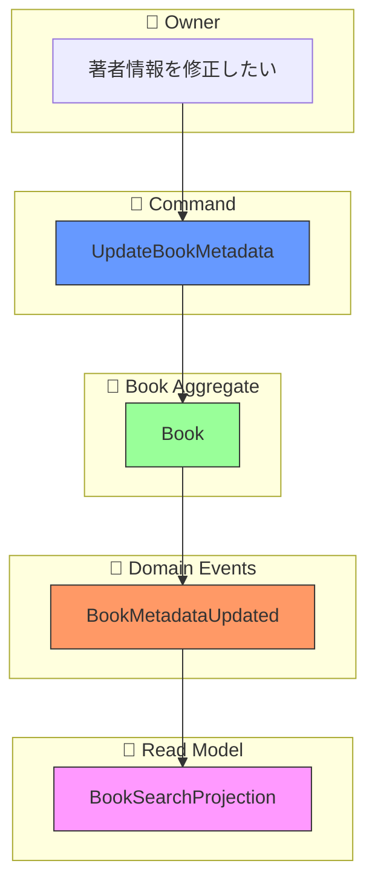

# イベントストーミング: 本の検索

**日付**: 2026-02-01
**参加者**:
- ユーザー（プロダクトオーナー）
- 田中博士（DDD専門家）
- 佐藤教授（データベース専門家）
- 鈴木氏（Scala専門家）
- 山田氏（分散システム専門家）

**スコープ**: テキスト検索による所有本のリストアップ

---

## 1. ビッグピクチャー

### 1.1 ユーザーストーリー

> 「所有している本をテキスト検索で探したい。タイトル、著者、タグなどで検索できるようにしたい」

### 1.2 要件（確定）

| 項目 | 決定 |
|------|------|
| 著者情報管理 | ハイブリッド（自動取得 + 手動編集） |
| 検索レベル | Standard（複数フィールド、部分一致、AND/OR） |
| 検索対象 | タイトル、著者、タグ、出版社・ISBN |

---

## 2. 専門家ディスカッション: 現状分析

### 田中博士（DDD）: 現在のドメインモデル確認

**現在のBookView構造**:
```scala
final case class BookView(
  id: BookId,
  title: NES,
  identifier: Option[BookIdentifier],  // ISBN, arXiv, DOI, Title
  location: Option[Location],
  tags: Set[Tag],
  devices: Set[Device],
  isDeleted: Boolean,
  lastModified: Timestamp
)
```

**問題点**: 著者（author）情報がBookViewに含まれていない

### 佐藤教授（データベース）: 検索インフラの検討

**結論**: Standard検索レベルではインメモリ全文検索で十分

```
インメモリ検索の実装方針:
├── BookSearchProjection（新規）
│   ├── 全書籍のインデックスを保持
│   ├── フィールド別の転置インデックス
│   └── 部分一致検索をサポート
└── 将来的にElasticsearchへの移行パスを確保
```

### 鈴木氏（Scala）: 検索クエリの型設計

```scala
// 検索条件を表す型
sealed trait SearchCriteria
object SearchCriteria:
  case class ByTitle(query: String) extends SearchCriteria
  case class ByAuthor(query: String) extends SearchCriteria
  case class ByTag(tagName: String) extends SearchCriteria
  case class ByPublisher(query: String) extends SearchCriteria
  case class ByIdentifier(query: String) extends SearchCriteria
  case class ByAll(query: String) extends SearchCriteria  // 全フィールド検索
  case class Combined(criteria: List[SearchCriteria], operator: LogicalOperator) extends SearchCriteria

enum LogicalOperator:
  case And, Or
```

### 山田氏（分散システム）: 検索の整合性

**Read Modelの特性**:
- 検索はRead Model（BookSearchProjection）に対して行う
- 結果整合性：登録直後の本が検索結果に出ない可能性あり
- 許容範囲：個人利用なら問題なし（数十ms〜数百msの遅延）

---

## 3. ユーザー決定事項

### 著者情報: ハイブリッド方式

**田中博士の設計**:

```
著者情報のライフサイクル:
1. 書籍登録時
   └── ISBN等から外部API（国会図書館等）でメタデータ取得
   └── 取得成功 → BookMetadataFetched イベント発行
   └── 取得失敗 → メタデータなしで登録続行

2. 手動編集時
   └── ユーザーがUI上で著者・出版社を編集
   └── UpdateBookMetadata コマンド
   └── BookMetadataUpdated イベント発行

3. 検索時
   └── Read Model（BookSearchProjection）を参照
   └── メタデータが永続化されているので高速
```

### 検索レベル: Standard

| 機能 | サポート |
|------|---------|
| 複数フィールド検索 | Yes |
| 部分一致 | Yes |
| AND/OR組み合わせ | Yes |
| あいまい検索 | No（将来対応） |
| スコアリング | シンプルな関連度のみ |

### 検索対象フィールド

| フィールド | 検索方式 |
|-----------|---------|
| タイトル | 部分一致 |
| 著者 | 部分一致 |
| タグ | 完全一致（正規化後） |
| 出版社 | 部分一致 |
| ISBN/識別子 | 前方一致 |

---

## 4. ドメインモデル設計

### 4.1 BookMetadata値オブジェクト（新規）

```scala
// domain/src/main/scala/com/handybookshelf/domain/BookMetadata.scala

final case class BookMetadata(
  author: Option[NES],
  publisher: Option[NES],
  publishedYear: Option[Int],
  description: Option[String]
)

object BookMetadata:
  val empty: BookMetadata = BookMetadata(None, None, None, None)

  def fromBookData(data: BookData): BookMetadata =
    BookMetadata(
      author = data.author.flatMap(_.nesOpt),
      publisher = data.publisher.flatMap(_.nesOpt),
      publishedYear = data.publishedYear,
      description = None
    )
```

### 4.2 BookAggregate拡張

```scala
final case class BookAggregate(
  bookId: BookId,
  title: Option[NES] = None,
  identifier: Option[BookIdentifier] = None,
  metadata: Option[BookMetadata] = None,  // 追加
  location: Option[Location] = None,
  tags: Set[Tag] = Set.empty,
  devices: Set[Device] = Set.empty,
  version: EventVersion = EventVersion.initial,
  uncommittedEvents: List[BookEvent] = List.empty,
  isDeleted: Boolean = false
) extends AggregateRoot[BookAggregate, BookEvent]
```

### 4.3 新規イベント

```scala
// メタデータが外部APIから取得された
final case class BookMetadataFetched(
  eventId: EventId,
  bookId: BookId,
  metadata: BookMetadata,
  source: MetadataSource,  // 取得元（NDL, OpenLibrary等）
  version: EventVersion,
  timestamp: Timestamp
) extends BookEvent

// メタデータが手動で更新された
final case class BookMetadataUpdated(
  eventId: EventId,
  bookId: BookId,
  oldMetadata: Option[BookMetadata],
  newMetadata: BookMetadata,
  version: EventVersion,
  timestamp: Timestamp
) extends BookEvent

// メタデータの取得元
enum MetadataSource:
  case NDL          // 国会図書館
  case OpenLibrary  // Open Library
  case GoogleBooks  // Google Books API
  case Manual       // 手動入力
```

### 4.4 新規コマンド

```scala
// メタデータを更新する
final case class UpdateBookMetadata(
  bookId: BookId,
  author: Option[String],
  publisher: Option[String],
  publishedYear: Option[Int],
  description: Option[String]
)
```

---

## 5. 検索Read Model設計

### 5.1 SearchableBook（検索用ビュー）

```scala
// domain/src/main/scala/com/handybookshelf/domain/BookSearch.scala

final case class SearchableBook(
  id: BookId,
  title: NES,
  author: Option[NES],
  publisher: Option[NES],
  identifier: Option[BookIdentifier],
  tags: Set[Tag],
  location: Option[Location],
  lastModified: Timestamp
)

final case class BookSearchResult(
  book: SearchableBook,
  score: Double,
  matchedFields: Set[SearchField]
)

final case class SearchResponse(
  results: List[BookSearchResult],
  total: Int,
  query: SearchQuery,
  took: Long  // 検索時間（ms）
)
```

### 5.2 SearchQuery

```scala
final case class SearchQuery(
  text: String,
  fields: Set[SearchField] = Set(SearchField.All),
  tagFilter: Set[String] = Set.empty,  // タグでフィルタ
  limit: Int = 50,
  offset: Int = 0,
  sortBy: SortField = SortField.Relevance
)

enum SearchField:
  case Title, Author, Tag, Publisher, Identifier, All

enum SortField:
  case Relevance, Title, Author, Recent
```

### 5.3 BookSearchProjection（新規）

```scala
// infrastructure/src/main/scala/com/handybookshelf/infrastructure/BookSearchProjection.scala

trait BookSearchProjection:
  /** テキスト検索 */
  def search(query: SearchQuery): IO[SearchResponse]

  /** IDで取得 */
  def getById(bookId: BookId): IO[Option[SearchableBook]]

  /** 全件取得（ページング付き） */
  def getAll(limit: Int, offset: Int): IO[List[SearchableBook]]

class InMemoryBookSearchProjection extends BookSearchProjection:
  private val books: Ref[IO, Map[BookId, SearchableBook]] = ...

  // 転置インデックス（高速検索用）
  private val titleIndex: Ref[IO, Map[String, Set[BookId]]] = ...
  private val authorIndex: Ref[IO, Map[String, Set[BookId]]] = ...
  private val tagIndex: Ref[IO, Map[String, Set[BookId]]] = ...

  def handleEvent(event: BookEvent): IO[Unit] = event match
    case BookRegistered(_, bookId, identifier, title, _, timestamp) =>
      // インデックスに追加
      addToIndex(bookId, title, None, Set.empty)

    case BookMetadataFetched(_, bookId, metadata, _, _, _) =>
      // 著者・出版社インデックスを更新
      updateMetadataIndex(bookId, metadata)

    case BookMetadataUpdated(_, bookId, _, newMetadata, _, _) =>
      updateMetadataIndex(bookId, newMetadata)

    case BookTagAdded(_, bookId, tag, _, _) =>
      addTagToIndex(bookId, tag)

    case BookTagRemoved(_, bookId, tag, _, _) =>
      removeTagFromIndex(bookId, tag)

    case BookRemoved(_, bookId, _, _) =>
      removeFromIndex(bookId)

    case _ => IO.unit
```

---

## 6. イベントストーミング結果

### 6.1 ドメインイベント（オレンジ付箋）

| イベント名 | 集約 | 説明 | 状態 |
|-----------|------|------|------|
| `BookMetadataFetched` | Book | 外部APIからメタデータ取得成功 | **新規** |
| `BookMetadataUpdated` | Book | メタデータが手動更新された | **新規** |

### 6.2 コマンド（青付箋）

| コマンド名 | アクター | 入力 | 状態 |
|-----------|---------|------|------|
| `UpdateBookMetadata` | Owner | bookId, author?, publisher?, year?, description? | **新規** |

### 6.3 クエリ（緑付箋）

| クエリ名 | 入力 | 出力 | 状態 |
|---------|------|------|------|
| `SearchBooks` | SearchQuery | SearchResponse | **新規** |
| `GetBookById` | bookId | Option[SearchableBook] | **新規** |
| `GetAllBooks` | limit, offset | List[SearchableBook] | **新規** |

### 6.4 Read Model / Projection（紫付箋）

| 名前 | トリガーイベント | 状態 |
|------|-----------------|------|
| `BookSearchProjection` | BookRegistered, BookMetadata*, BookTag*, BookRemoved | **新規** |

---

## 7. フロー図

### 7.1 検索フロー



### 7.2 メタデータ更新フロー



---

## 8. 検索アルゴリズム

### 8.1 部分一致検索

```scala
def containsIgnoreCase(text: String, query: String): Boolean =
  text.toLowerCase.contains(query.toLowerCase)

def searchByTitle(query: String, books: Map[BookId, SearchableBook]): Set[BookId] =
  books.filter { case (_, book) =>
    containsIgnoreCase(book.title, query)
  }.keySet
```

### 8.2 複合検索（AND/OR）

```scala
def search(criteria: SearchCriteria, books: Map[BookId, SearchableBook]): Set[BookId] =
  criteria match
    case ByTitle(q) => searchByTitle(q, books)
    case ByAuthor(q) => searchByAuthor(q, books)
    case ByTag(t) => searchByTag(t, books)
    case ByAll(q) =>
      searchByTitle(q, books) | searchByAuthor(q, books) | searchByPublisher(q, books)
    case Combined(criteria, And) =>
      criteria.map(c => search(c, books)).reduce(_ & _)
    case Combined(criteria, Or) =>
      criteria.map(c => search(c, books)).reduce(_ | _)
```

### 8.3 スコアリング（シンプル版）

```scala
def calculateScore(book: SearchableBook, query: String, matchedFields: Set[SearchField]): Double =
  var score = 0.0

  // タイトル完全一致は高スコア
  if book.title.toLowerCase == query.toLowerCase then
    score += 1.0
  // タイトル部分一致
  else if containsIgnoreCase(book.title, query) then
    score += 0.7

  // 著者一致
  book.author.foreach { author =>
    if containsIgnoreCase(author, query) then score += 0.5
  }

  // タグ一致
  if book.tags.exists(t => t.name.toLowerCase == query.toLowerCase) then
    score += 0.8

  score
```

---

## 9. API設計

### 9.1 検索エンドポイント

```
GET /api/books/search
Query Parameters:
  - q: 検索クエリ（必須）
  - fields: 検索対象（title,author,tag,publisher,all）デフォルト: all
  - tags: タグフィルタ（カンマ区切り）
  - limit: 取得件数（デフォルト: 50, 最大: 100）
  - offset: オフセット
  - sort: 並び順（relevance,title,author,recent）デフォルト: relevance

Response 200:
{
  "results": [
    {
      "id": "01ARZ3NDEKTSV4RRFFQ69G5FAV",
      "title": "プログラミングScala",
      "author": "Dean Wampler",
      "publisher": "オライリー・ジャパン",
      "tags": ["programming", "scala"],
      "location": "本棚A",
      "score": 0.95,
      "matchedFields": ["title", "tag"]
    }
  ],
  "total": 15,
  "took": 12
}
```

### 9.2 メタデータ更新エンドポイント

```
PUT /api/books/{bookId}/metadata
Content-Type: application/json

{
  "author": "Dean Wampler, Alex Payne",
  "publisher": "オライリー・ジャパン",
  "publishedYear": 2021,
  "description": "Scala 3対応の決定版"
}

Response 200:
{
  "bookId": "01ARZ3NDEKTSV4RRFFQ69G5FAV",
  "message": "Metadata updated successfully"
}
```

---

## 10. 専門家最終コメント

### 田中博士（DDD）

> メタデータをBook集約に含めることで、検索に必要な情報が一箇所に集約されます。ハイブリッド方式により、自動取得の利便性と手動編集の柔軟性を両立できます。

### 佐藤教授（データベース）

> インメモリ検索は数千冊規模では十分なパフォーマンスです。転置インデックスを使うことで、O(1)に近い検索速度を実現できます。将来的にElasticsearchへの移行も`BookSearchProjection`のインターフェースを維持すれば容易です。

### 鈴木氏（Scala）

> `SearchCriteria`のADT設計により、型安全な検索条件の組み立てが可能です。将来的な検索機能拡張も容易です。

### 山田氏（分散システム）

> 検索はRead Modelに対して行うため、Write操作と競合しません。結果整合性の遅延は個人利用では問題になりません。

---

## 11. 実装タスク

### Phase 1: ドメイン層
1. [ ] `BookMetadata`値オブジェクトの作成
2. [ ] `MetadataSource` enumの作成
3. [ ] `BookMetadataFetched`イベントの追加
4. [ ] `BookMetadataUpdated`イベントの追加
5. [ ] `BookAggregate`にメタデータ関連メソッド追加

### Phase 2: 検索Read Model
6. [ ] `SearchableBook`の作成
7. [ ] `SearchQuery`, `SearchResponse`の作成
8. [ ] `BookSearchProjection`トレイトの作成
9. [ ] `InMemoryBookSearchProjection`の実装
10. [ ] 既存Projectionとの統合

### Phase 3: API層
11. [ ] 検索エンドポイント（GET /api/books/search）
12. [ ] メタデータ更新エンドポイント（PUT /api/books/{id}/metadata）

### Phase 4: テスト
13. [ ] 検索アルゴリズムの単体テスト
14. [ ] BookSearchProjectionの単体テスト
15. [ ] 検索APIの統合テスト

---

## 12. 修正対象ファイル

| ファイル | 変更内容 |
|---------|---------|
| `domain/.../BookMetadata.scala` | 新規作成 |
| `domain/.../BookEvents.scala` | MetadataFetched, MetadataUpdated追加 |
| `domain/.../BookAggregate.scala` | metadata追加、updateMetadataメソッド |
| `domain/.../BookSearch.scala` | 新規作成（検索関連の型） |
| `infrastructure/.../BookSearchProjection.scala` | 新規作成 |
| `controller/.../BookSearchEndpoints.scala` | 新規作成 |
| `controller/.../BookSearchRoutes.scala` | 新規作成 |

---

## 13. 本の検索イベントストーミング完了

### 成果物
- コマンド: 1個（新規）
- ドメインイベント: 2個（新規）
- クエリ: 3個（新規）
- Read Model: BookSearchProjection（新規）

### 設計ポイント
- **ハイブリッドメタデータ**: 自動取得 + 手動編集
- **Standard検索**: 複数フィールド、部分一致、AND/OR
- **インメモリ検索**: 転置インデックスによる高速検索
- **将来拡張**: Elasticsearch移行パスを確保

---

*イベントストーミング（本の検索）完了*
