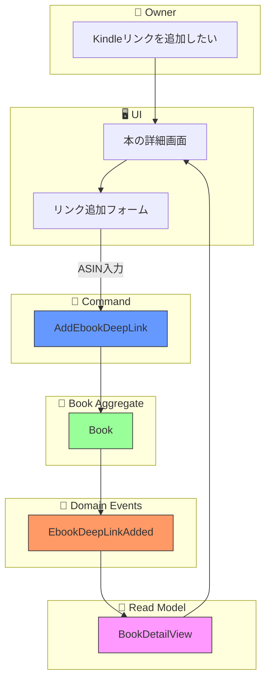
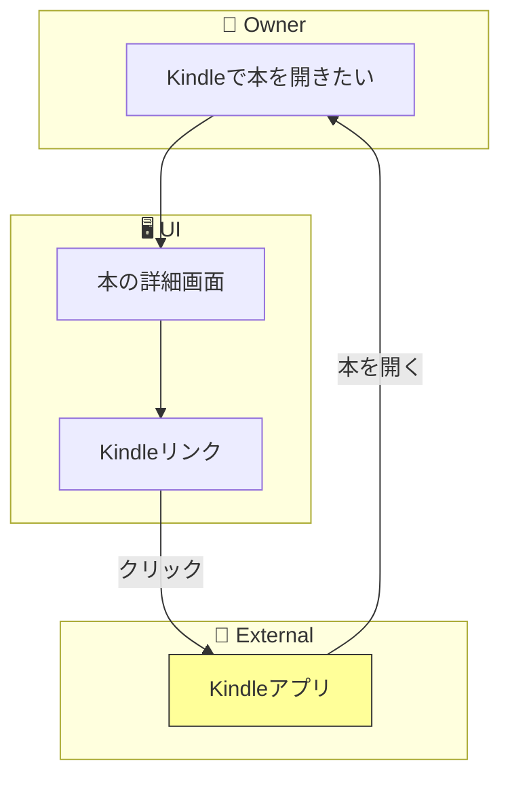

# イベントストーミング: 電子書籍ディープリンク

**日付**: 2026-02-01
**参加者**:
- ユーザー（プロダクトオーナー）
- 田中博士（DDD専門家）
- 佐藤教授（データベース専門家）
- 鈴木氏（Scala専門家）
- 山田氏（分散システム専門家）

**スコープ**: 電子書籍のディープリンク保存とアプリ起動

---

## 1. ビッグピクチャー

### 1.1 ユーザーストーリー

> 「Kindleの本を登録したら、リンクを保持し、クリックするとKindleアプリを起動して該当の本を開きたい」

### 1.2 要件（確定）

| 項目 | 決定 |
|------|------|
| 保存方法 | BookAggregateにebookLinks: Set[EbookDeepLink]を追加 |
| リンク形式 | sealed traitでプラットフォーム別に型安全に定義 |
| 登録方法 | 手動入力（将来的にISBNからの自動生成を検討） |
| 複数リンク | 1冊の本に複数プラットフォームのリンクを保存可能 |

---

## 2. 専門家ディスカッション

### 田中博士（DDD）: ドメインモデルの設計

**設計の選択肢**:

```
選択肢A: StorageLocationの拡張
  └── EbookPlatformにdeepLinkを含める

選択肢B: 別の値オブジェクトとして分離
  └── OwnedFormatにdeepLink: Option[DeepLink]を追加

選択肢C: BookAggregateに直接追加（採用）
  └── ebookLinks: Set[EbookDeepLink]
```

**採用理由（選択肢C）**:
- ディープリンクは本の属性として独立している
- 同じ本を複数プラットフォームで所有可能
- イベントソーシングでリンクの追加/削除を追跡可能

### 佐藤教授（データベース）: プラットフォーム調査

**主要プラットフォームのディープリンク形式**:

| プラットフォーム | リンク形式 | 識別子 |
|-----------------|-----------|--------|
| Kindle | `kindle://book?action=open&asin=XXX` | ASIN（10文字英数字） |
| Google Play Books | `https://play.google.com/store/books/details?id=XXX` | Book ID |
| Kobo | `https://www.kobo.com/ebook/XXX` | ISBN |
| Apple Books | `itms-books://apple.co/book/idXXX` | Apple Book ID |
| その他 | 汎用URL | - |

### 鈴木氏（Scala）: 型安全な設計

```scala
// プラットフォーム種別
enum EbookPlatformType:
  case Kindle, Kobo, GooglePlayBooks, AppleBooks, Other(name: NES)

// ディープリンク（プラットフォーム別）
sealed trait EbookDeepLink:
  def url: String
  def platformType: EbookPlatformType

object EbookDeepLink:
  final case class KindleLink(asin: ASIN, location: Option[Int]) extends EbookDeepLink:
    override def url: String =
      val base = s"kindle://book?action=open&asin=${asin.value}"
      location.fold(base)(loc => s"$base&location=$loc")
    override def platformType = EbookPlatformType.Kindle

  final case class GooglePlayBooksLink(bookId: GoogleBooksId) extends EbookDeepLink
  final case class KoboLink(isbn: ISBN) extends EbookDeepLink
  final case class AppleBooksLink(bookId: AppleBooksId) extends EbookDeepLink
  final case class GenericLink(platform: NES, rawUrl: ValidUrl) extends EbookDeepLink
```

### 山田氏（分散システム）: 整合性

**考慮点**:
- ディープリンクは本に紐づく独立した属性
- 追加/更新/削除をイベントとして記録
- Read Modelで詳細画面に表示

---

## 3. ドメインモデル設計

### 3.1 新規型定義（util層）

```scala
// ASIN: 10文字の英数字
opaque type ASIN = String :| Match["^[A-Z0-9]{10}$"]

// Google Books ID
opaque type GoogleBooksId = String :| Match["^[a-zA-Z0-9_-]+$"]

// Apple Books ID
opaque type AppleBooksId = String :| Match["^id[0-9]+$"]

// 有効なURL
opaque type ValidUrl = String :| Match["^https?://.*$"]
```

### 3.2 EbookDeepLink sealed trait

```scala
sealed trait EbookDeepLink:
  def url: String
  def platformType: EbookPlatformType
  def displayName: String = platformType match
    case EbookPlatformType.Kindle         => "Kindle"
    case EbookPlatformType.Kobo           => "Kobo"
    case EbookPlatformType.GooglePlayBooks => "Google Play Books"
    case EbookPlatformType.AppleBooks     => "Apple Books"
    case EbookPlatformType.Other(name)    => name
```

### 3.3 BookAggregate拡張

```scala
final case class BookAggregate(
  bookId: BookId,
  title: Option[NES] = None,
  identifier: Option[BookIdentifier] = None,
  metadata: Option[BookMetadata] = None,
  location: Option[Location] = None,
  tags: Set[Tag] = Set.empty,
  devices: Set[Device] = Set.empty,
  ebookLinks: Set[EbookDeepLink] = Set.empty,  // 新規追加
  version: EventVersion = EventVersion.initial,
  uncommittedEvents: List[BookEvent] = List.empty,
  isDeleted: Boolean = false
)
```

---

## 4. イベントストーミング結果

### 4.1 ドメインイベント（オレンジ付箋）

| イベント名 | 集約 | 説明 | 状態 |
|-----------|------|------|------|
| `EbookDeepLinkAdded` | Book | ディープリンク追加 | **新規** |
| `EbookDeepLinkUpdated` | Book | ディープリンク更新 | **新規** |
| `EbookDeepLinkRemoved` | Book | ディープリンク削除 | **新規** |

### 4.2 コマンド（青付箋）

| コマンド名 | アクター | 入力 | 状態 |
|-----------|---------|------|------|
| `AddEbookDeepLink` | Owner | bookId, deepLink | **新規** |
| `UpdateEbookDeepLink` | Owner | bookId, oldLink, newLink | **新規** |
| `RemoveEbookDeepLink` | Owner | bookId, deepLink | **新規** |

### 4.3 クエリ（緑付箋）

| クエリ名 | 入力 | 出力 | 状態 |
|---------|------|------|------|
| `GetEbookLinks` | bookId | List[EbookLinkView] | **新規** |

### 4.4 Read Model

| 名前 | 変更内容 | 状態 |
|------|---------|------|
| `BookDetailView` | ebookLinks追加 | **拡張** |

---

## 5. フロー図

### 5.1 ディープリンク追加フロー



### 5.2 ディープリンク使用フロー



---

## 6. API設計

### 6.1 エンドポイント

```
POST   /api/books/{bookId}/ebook-links           - リンク追加
GET    /api/books/{bookId}/ebook-links           - リンク一覧
PUT    /api/books/{bookId}/ebook-links/{platform} - リンク更新
DELETE /api/books/{bookId}/ebook-links/{platform} - リンク削除
```

### 6.2 リクエスト例（Kindle）

```json
POST /api/books/01HXYZ.../ebook-links
{
  "platformType": "kindle",
  "asin": "B00TIK9PL8",
  "location": 181
}
```

### 6.3 レスポンス例

```json
{
  "bookId": "01HXYZ...",
  "links": [
    {
      "platformType": "kindle",
      "displayName": "Kindle",
      "url": "kindle://book?action=open&asin=B00TIK9PL8&location=181"
    },
    {
      "platformType": "kobo",
      "displayName": "Kobo",
      "url": "https://www.kobo.com/ebook/9784873115658"
    }
  ]
}
```

---

## 7. 詳細画面での表示

### BookDetailView拡張

```scala
final case class BookDetailView(
  // ... 既存フィールド ...
  ebookLinks: List[EbookLinkView]  // 新規追加
)

final case class EbookLinkView(
  platformType: String,      // "kindle", "kobo", etc.
  displayName: String,       // "Kindle", "Kobo", etc.
  url: String,               // クリック可能なURL
  iconUrl: Option[String]    // プラットフォームアイコン（将来対応）
)
```

### UI表示イメージ

```
┌─────────────────────────────────────────────────────┐
│                  本の詳細画面                        │
│                                                     │
│  タイトル: プログラミングScala                       │
│  著者: Dean Wampler                                 │
│                                                     │
│  ───────────────────────────────────                │
│                                                     │
│  電子書籍リンク:                                     │
│    [📱 Kindle で開く]  ← クリックでアプリ起動        │
│    [📚 Kobo で開く]                                 │
│    [+リンクを追加]                                   │
│                                                     │
└─────────────────────────────────────────────────────┘
```

---

## 8. 専門家最終コメント

### 田中博士（DDD）

> ディープリンクは本の属性として`Set[EbookDeepLink]`で管理するのが適切です。プラットフォームごとに型を分けることで、各プラットフォーム固有の識別子（ASIN, ISBN等）を型安全に扱えます。

### 佐藤教授（データベース）

> プラットフォームごとのリンク形式は異なりますが、sealed traitで抽象化することで統一的に扱えます。将来的にISBNからASINを自動取得する機能を追加することも可能です。

### 鈴木氏（Scala）

> Iron型制約でASINやURLの形式を検証できます。`EbookDeepLink`のsealed traitにより、新しいプラットフォームの追加も型安全に行えます。

### 山田氏（分散システム）

> ディープリンクの追加/削除はイベントとして記録されるため、履歴の追跡が可能です。外部アプリとの連携はURLスキームに依存しますが、これはドメインの責務外です。

---

## 9. 実装タスク

### Phase 1: ドメイン層
1. [ ] ASIN, GoogleBooksId, AppleBooksId, ValidUrl型の追加（util）
2. [ ] EbookPlatformType enum作成
3. [ ] EbookDeepLink sealed trait作成
4. [ ] 新規イベント追加（EbookDeepLinkAdded等）
5. [ ] 新規コマンド追加
6. [ ] BookAggregate拡張（ebookLinksフィールド、メソッド）

### Phase 2: API層
7. [ ] EbookLinkEndpoints作成
8. [ ] EbookLinkRoutes作成
9. [ ] UseCase実装

### Phase 3: Read Model
10. [ ] EbookLinkView追加
11. [ ] BookDetailView拡張
12. [ ] Projector更新

### Phase 4: テスト
13. [ ] EbookDeepLink単体テスト
14. [ ] BookAggregate拡張テスト
15. [ ] API統合テスト

---

## 10. 修正対象ファイル

| ファイル | 変更内容 |
|---------|---------|
| `util/.../EbookIdentifiers.scala` | 新規（ASIN, GoogleBooksId等） |
| `domain/.../EbookDeepLink.scala` | 新規 |
| `domain/.../BookEvents.scala` | イベント追加 |
| `domain/.../BookCommands.scala` | コマンド追加 |
| `domain/.../BookAggregate.scala` | ebookLinks追加 |
| `domain/.../BookProjections.scala` | EbookLinkView追加 |
| `controller/.../EbookLinkEndpoints.scala` | 新規 |
| `controller/.../EbookLinkRoutes.scala` | 新規 |

---

## 11. 今後の課題（将来対応）

| 課題 | 説明 | 優先度 |
|------|------|--------|
| ASIN自動取得 | Amazon APIからISBN→ASIN変換 | 低 |
| リンク検証 | URLの有効性チェック | 低 |
| プラットフォーム拡張 | honto, BookWalker等の追加 | 中 |

---

## 12. 電子書籍ディープリンク イベントストーミング完了

### 成果物
- コマンド: 3個（新規）
- ドメインイベント: 3個（新規）
- クエリ: 1個（新規）
- Read Model拡張: BookDetailView

### 設計ポイント
- **複数プラットフォーム対応**: 1冊にKindle + Kobo等を登録可能
- **型安全**: sealed traitでプラットフォーム別に定義
- **手動登録**: 初期リリースは手動入力
- **URL生成**: プラットフォームごとのディープリンク形式に対応

---

*イベントストーミング（電子書籍ディープリンク）完了*
