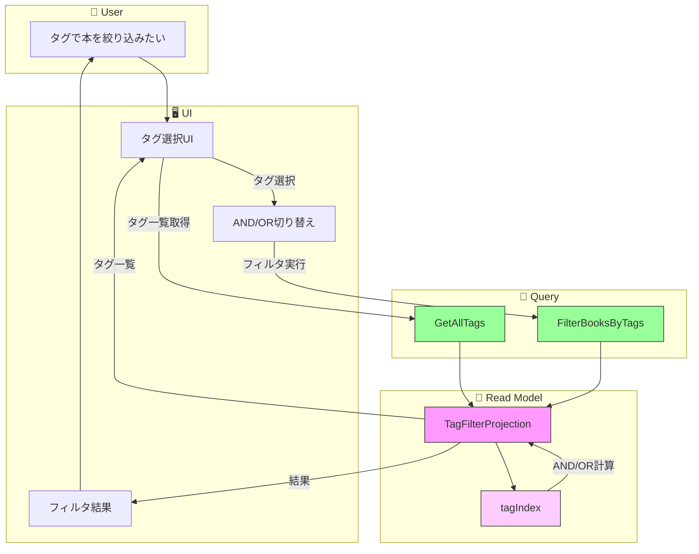

# イベントストーミング: タグによるフィルタリング

**日付**: 2026-02-01
**参加者**:
- ユーザー（プロダクトオーナー）
- 田中博士（DDD専門家）
- 佐藤教授（データベース専門家）
- 鈴木氏（Scala専門家）
- 山田氏（分散システム専門家）

**スコープ**: タグを選択して該当する本をリストアップ

---

## 1. ビッグピクチャー

### 1.1 ユーザーストーリー

> 「タグを選択して、そのタグを持つ本の一覧を見たい。複数タグで絞り込みもしたい」

### 1.2 要件（確定）

| 項目 | 決定 |
|------|------|
| 複数タグ組み合わせ | AND/OR両方選択可能（UI切り替え） |
| 検索との関係 | 独立した機能（別画面） |
| 単一タグ選択 | 既存TagViewProjectionを活用 |

---

## 2. 専門家ディスカッション

### 田中博士（DDD）: 既存資産の活用

**現状の`TagViewProjection`**:
```scala
class TagViewProjection(bookViewProjection: BookViewProjection):
  // タグ名で本を取得
  def getView(tagName: String): IO[Option[TagView]]

  // 全タグとその本を取得
  def getAllViews(): IO[List[TagView]]
```

**分析**:
- 単一タグフィルタリングは既存で対応可能
- 複数タグ（AND/OR）は拡張が必要
- Read Model専用のクエリ機能として実装

**結論**: 新規コマンド/イベントは不要。**クエリのみの追加**で実現可能。

### 佐藤教授（データベース）: フィルタリング戦略

**単一タグ**: O(n) - 全書籍をスキャン
**複数タグAND**: タグごとの書籍集合の積（∩）
**複数タグOR**: タグごとの書籍集合の和（∪）

```
効率的な実装:
1. tagIndex: Map[TagName, Set[BookId]] を維持
2. AND: tags.map(tagIndex).reduce(_ & _)
3. OR:  tags.map(tagIndex).reduce(_ | _)
```

**推奨**: 既存のTagViewProjectionを拡張するか、専用の`TagFilterProjection`を追加

### 鈴木氏（Scala）: フィルタリングクエリの型設計

```scala
// フィルタリング条件
final case class TagFilterQuery(
  tags: Set[NormalizedTagName],
  operator: TagFilterOperator,
  limit: Int = 50,
  offset: Int = 0,
  sortBy: BookSortField = BookSortField.Title
)

enum TagFilterOperator:
  case And  // すべてのタグを含む
  case Or   // いずれかのタグを含む

enum BookSortField:
  case Title, Author, Recent, TagCount

// フィルタリング結果
final case class TagFilterResult(
  books: List[BookSummary],
  total: Int,
  appliedTags: Set[NormalizedTagName],
  operator: TagFilterOperator
)
```

### 山田氏（分散システム）: パフォーマンス考慮

**個人利用規模（〜5000冊）での計算量**:
- タグ数: 〜500個
- 1タグあたり平均: 〜50冊

```
AND検索（3タグ）:
  Set1(50) ∩ Set2(50) ∩ Set3(50) → 数十件
  計算量: O(min(|Set1|, |Set2|, |Set3|)) ≈ O(50)

OR検索（3タグ）:
  Set1(50) ∪ Set2(50) ∪ Set3(50) → 〜150件（重複除去後）
  計算量: O(|Set1| + |Set2| + |Set3|) ≈ O(150)
```

**結論**: インメモリで十分高速。最適化は不要。

---

## 3. 設計決定

### 3.1 アーキテクチャ

```
┌─────────────────────────────────────────────────────┐
│                    UI Layer                         │
│  ┌─────────────┐    ┌─────────────────────────┐    │
│  │ タグ一覧     │    │ フィルタ結果（本一覧）    │    │
│  │ □ SF        │    │ ・プログラミングScala    │    │
│  │ ☑ 技術書    │ →  │ ・実践Scala入門         │    │
│  │ ☑ Scala    │    │ ・関数型プログラミング    │    │
│  │ (AND/OR)   │    │                         │    │
│  └─────────────┘    └─────────────────────────┘    │
└─────────────────────────────────────────────────────┘
                          │
                          ▼
┌─────────────────────────────────────────────────────┐
│                  Query Layer                        │
│  FilterBooksByTags(tags, operator)                  │
└─────────────────────────────────────────────────────┘
                          │
                          ▼
┌─────────────────────────────────────────────────────┐
│                 Read Model                          │
│  TagFilterProjection                                │
│  ├── tagIndex: Map[TagName, Set[BookId]]           │
│  └── books: Map[BookId, BookSummary]               │
└─────────────────────────────────────────────────────┘
```

### 3.2 Write Side

**変更なし** - タグフィルタリングはRead Model専用のクエリ機能

### 3.3 Read Side（拡張）

既存の`TagViewProjection`を拡張、または`TagFilterProjection`を新設

```scala
trait TagFilterProjection:
  /** 複数タグでフィルタリング */
  def filterByTags(query: TagFilterQuery): IO[TagFilterResult]

  /** タグ一覧を取得（フィルタUI用） */
  def getAllTags(): IO[List[TagInfo]]

  /** 特定のタグの本を取得（単一タグ） */
  def getBooksByTag(tagName: NormalizedTagName): IO[List[BookSummary]]
```

---

## 4. イベントストーミング結果

### 4.1 ドメインイベント（オレンジ付箋）

**新規イベントなし** - タグ関連イベント（BookTagAdded, BookTagRemoved）は既存

### 4.2 コマンド（青付箋）

**新規コマンドなし** - フィルタリングはクエリのみ

### 4.3 クエリ（緑付箋）

| クエリ名 | 入力 | 出力 | 状態 |
|---------|------|------|------|
| `FilterBooksByTags` | TagFilterQuery | TagFilterResult | **新規** |
| `GetAllTags` | - | List[TagInfo] | タグ付けで定義済み |
| `GetBooksByTag` | tagName | List[BookSummary] | 既存拡張 |

### 4.4 Read Model

| 名前 | 説明 | 状態 |
|------|------|------|
| `TagFilterProjection` | タグフィルタリング専用 | **新規** or 既存拡張 |

---

## 5. フロー図

### 5.1 タグフィルタリングフロー



---

## 6. 実装設計

### 6.1 TagFilterQuery

```scala
final case class TagFilterQuery(
  tags: Set[NormalizedTagName],
  operator: TagFilterOperator = TagFilterOperator.And,
  limit: Int = 50,
  offset: Int = 0,
  sortBy: BookSortField = BookSortField.Title
)

object TagFilterQuery:
  def single(tag: NormalizedTagName): TagFilterQuery =
    TagFilterQuery(Set(tag))

  def and(tags: NormalizedTagName*): TagFilterQuery =
    TagFilterQuery(tags.toSet, TagFilterOperator.And)

  def or(tags: NormalizedTagName*): TagFilterQuery =
    TagFilterQuery(tags.toSet, TagFilterOperator.Or)
```

### 6.2 フィルタリングアルゴリズム

```scala
def filterByTags(query: TagFilterQuery): IO[TagFilterResult] =
  for
    allBooks <- booksRef.get
    tagIdx   <- tagIndexRef.get

    // タグごとの書籍ID集合を取得
    tagSets = query.tags.toList.map(tag => tagIdx.getOrElse(tag, Set.empty))

    // AND/ORで結合
    matchedIds = query.operator match
      case TagFilterOperator.And =>
        if tagSets.isEmpty then Set.empty
        else tagSets.reduce(_ & _)
      case TagFilterOperator.Or =>
        tagSets.foldLeft(Set.empty[BookId])(_ | _)

    // BookSummaryに変換
    matchedBooks = matchedIds.toList.flatMap(id => allBooks.get(id))

    // ソート
    sorted = sortBooks(matchedBooks, query.sortBy)

    // ページング
    paged = sorted.slice(query.offset, query.offset + query.limit)

  yield TagFilterResult(
    books = paged,
    total = matchedIds.size,
    appliedTags = query.tags,
    operator = query.operator
  )
```

### 6.3 TagFilterProjectionの実装

```scala
class InMemoryTagFilterProjection extends TagFilterProjection:
  private val booksRef: Ref[IO, Map[BookId, BookSummary]] = ...
  private val tagIndexRef: Ref[IO, Map[NormalizedTagName, Set[BookId]]] = ...

  def handleEvent(event: BookEvent): IO[Unit] = event match
    case BookRegistered(_, bookId, _, title, _, timestamp) =>
      booksRef.update(_.updated(bookId, BookSummary(bookId, title, None, 0, 0)))

    case BookTagAdded(_, bookId, tag, _, _) =>
      tagIndexRef.update { idx =>
        val current = idx.getOrElse(tag.name, Set.empty)
        idx.updated(tag.name, current + bookId)
      } >> updateBookTagCount(bookId, 1)

    case BookTagRemoved(_, bookId, tag, _, _) =>
      tagIndexRef.update { idx =>
        val current = idx.getOrElse(tag.name, Set.empty)
        val updated = current - bookId
        if updated.isEmpty then idx.removed(tag.name)
        else idx.updated(tag.name, updated)
      } >> updateBookTagCount(bookId, -1)

    case BookRemoved(_, bookId, _, _) =>
      removeBookFromAllIndexes(bookId)

    case _ => IO.unit
```

---

## 7. API設計

### 7.1 タグフィルタリングエンドポイント

```
GET /api/books/filter-by-tags
Query Parameters:
  - tags: タグ名（カンマ区切り、必須）
  - operator: and | or（デフォルト: and）
  - limit: 取得件数（デフォルト: 50）
  - offset: オフセット
  - sort: title | author | recent | tag_count（デフォルト: title）

Example:
GET /api/books/filter-by-tags?tags=scala,programming&operator=and&limit=20

Response 200:
{
  "books": [
    {
      "id": "01ARZ3NDEKTSV4RRFFQ69G5FAV",
      "title": "プログラミングScala",
      "location": "本棚A",
      "tagCount": 3,
      "deviceCount": 2
    }
  ],
  "total": 5,
  "appliedTags": ["scala", "programming"],
  "operator": "and"
}
```

### 7.2 タグ一覧エンドポイント（タグ付けで定義済み）

```
GET /api/tags
Response 200:
{
  "tags": [
    {"name": "programming", "bookCount": 25},
    {"name": "scala", "bookCount": 12},
    {"name": "sf", "bookCount": 8}
  ]
}
```

---

## 8. 専門家最終コメント

### 田中博士（DDD）

> タグフィルタリングはWrite Sideに影響を与えない純粋なクエリ機能です。CQRSの原則に沿って、Read Model専用の機能として実装するのが適切です。新規のドメインイベントやコマンドは不要です。

### 佐藤教授（データベース）

> 転置インデックス（tagIndex）を使えば、AND/OR両方とも効率的に計算できます。個人利用規模ではインメモリで十分です。将来的にタグ数や書籍数が増えた場合は、Redis等への移行も容易です。

### 鈴木氏（Scala）

> `TagFilterOperator` enumと`TagFilterQuery`の設計により、型安全なフィルタリングが可能です。将来的にNOT演算子や複合条件が必要になった場合も、ADTの拡張で対応できます。

### 山田氏（分散システム）

> フィルタリングはRead Modelに対する計算のみなので、Write操作と競合しません。結果整合性の影響も、タグ追加直後に即座にフィルタ結果に反映されないケースがありますが、個人利用では許容範囲です。

---

## 9. 実装タスク

### Phase 1: Read Model
1. [ ] `TagFilterQuery`, `TagFilterResult`の作成
2. [ ] `TagFilterOperator`, `BookSortField` enumの作成
3. [ ] `TagFilterProjection`トレイトの作成
4. [ ] `InMemoryTagFilterProjection`の実装
5. [ ] 既存`TagViewProjection`との統合または置き換え

### Phase 2: API層
6. [ ] フィルタリングエンドポイント（GET /api/books/filter-by-tags）
7. [ ] タグ一覧エンドポイント（タグ付けで定義済みと共通化）

### Phase 3: テスト
8. [ ] AND/ORフィルタリングの単体テスト
9. [ ] ページング・ソートのテスト
10. [ ] APIの統合テスト

---

## 10. 修正対象ファイル

| ファイル | 変更内容 |
|---------|---------|
| `domain/.../TagFilter.scala` | 新規作成（クエリ関連の型） |
| `domain/.../BookProjections.scala` | TagViewProjection拡張 or 置き換え |
| `infrastructure/.../TagFilterProjection.scala` | 新規作成（インメモリ実装） |
| `controller/.../TagFilterEndpoints.scala` | 新規作成 |
| `controller/.../TagFilterRoutes.scala` | 新規作成 |

---

## 11. 検索機能との関係整理

| 機能 | 用途 | API |
|------|------|-----|
| **テキスト検索** | タイトル・著者等で検索 | GET /api/books/search |
| **タグフィルタリング** | タグで絞り込み | GET /api/books/filter-by-tags |
| **タグ一覧** | 利用可能なタグ表示 | GET /api/tags |

**設計ポイント**: 検索とフィルタリングは独立した機能。将来的に組み合わせが必要になった場合は、検索APIにタグフィルタオプションを追加可能。

---

## 12. タグフィルタリング イベントストーミング完了

### 成果物
- コマンド: 0個（Write Sideに変更なし）
- ドメインイベント: 0個（既存イベント流用）
- クエリ: 1個（新規）
- Read Model: TagFilterProjection（新規）

### 設計ポイント
- **Read Model専用**: Write Sideに影響なし
- **AND/OR対応**: UI上で切り替え可能
- **転置インデックス**: 効率的なフィルタリング
- **検索と独立**: 別機能として実装

---

*イベントストーミング（タグフィルタリング）完了*
