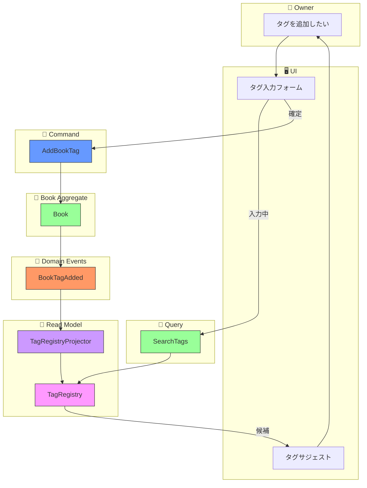
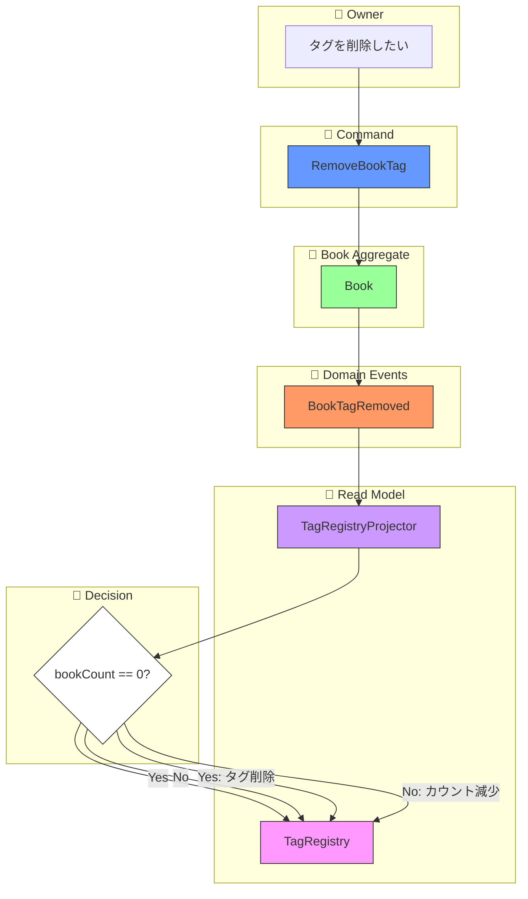

# イベントストーミング: タグ付け

**日付**: 2026-02-01
**参加者**:
- ユーザー（プロダクトオーナー）
- 田中博士（DDD専門家）
- 佐藤教授（データベース専門家）
- 鈴木氏（Scala専門家）
- 山田氏（分散システム専門家）

**スコープ**: 書籍へのタグ付けとタグ管理

---

## 1. ビッグピクチャー

### 1.1 ユーザーストーリー

> 「書籍にタグを付けて整理したい。タグは自由に入力でき、一度登録されたタグは一覧から選択できるようにしたい」

### 1.2 要件（確定済み）

| 項目 | 決定 |
|------|------|
| タグ正規化 | 大文字小文字を区別しない（「SF」「sf」「Sf」は同一） |
| 削除ポリシー | 参照カウント0で自動削除 |
| タグ名制約 | 最大50文字、空白・特殊文字許可 |

---

## 2. 専門家ディスカッション: 初期分析

### 田中博士（DDD）: タグのモデリング

**質問**: タグは集約か？値オブジェクトか？

```
オプション1: 値オブジェクト（現状）
  └── Book集約の一部としてのみ存在
  └── タグ一覧はProjectionで派生

オプション2: 独立した集約
  └── Tag集約を新設（TagCreated, TagRenamedイベント等）
  └── 複雑性が増す

オプション3: Read Model専用のTagRegistry
  └── Write側は現状維持
  └── Read側でタグ一覧を管理
```

**分析**:
- タグは「本に付ける印」であり、本から独立した存在ではない
- ただし「システムに登録されたタグ一覧」という参照用途がある
- タグ自体のライフサイクル管理（作成・更新・削除）は必要か？

### 佐藤教授（データベース）: データ整合性

**質問**: 参照カウント0で自動削除する場合、どう管理する？

```
案A: Projectionで計算
  └── 書籍イベントからタグ使用状況を集計
  └── 利点: Write側がシンプル
  └── 欠点: 集計のタイミング依存

案B: TagRegistryで明示的に管理
  └── BookTagAddedイベントでカウント++
  └── BookTagRemovedイベントでカウント--
  └── 利点: 正確なカウント
  └── 欠点: 複雑性増加
```

### 鈴木氏（Scala）: 型安全な正規化

```scala
// 正規化されたタグ名の型
opaque type NormalizedTagName = String

object NormalizedTagName:
  def apply(raw: String): Either[TagError, NormalizedTagName] =
    val trimmed = raw.trim
    val normalized = trimmed.toLowerCase  // 小文字に統一
    if normalized.isEmpty then Left(TagError.Empty)
    else if normalized.length > 50 then Left(TagError.TooLong)
    else Right(normalized)
```

### 山田氏（分散システム）: 競合状態

**質問**: 同時に同じタグ名を付けようとした場合は？

```
シナリオ:
  ユーザーAが「SF」タグを書籍1に追加
  ユーザーBが「sf」タグを書籍2に追加（同時）

期待動作:
  - 両方とも同じ正規化タグ「sf」として処理
  - タグ一覧には1つだけ表示
```

---

## 3. ユーザー決定事項（追加ディスカッション）

### 質問: タグのモデリング方式

**田中博士の提案**:

CQRSアーキテクチャを活かし、以下の方式を提案します：

```
Write Side（コマンド側）
──────────────────────
- Book集約: タグの追加/削除（既存通り）
- タグは値オブジェクト（NormalizedTagName）
- イベント: BookTagAdded, BookTagRemoved

Read Side（クエリ側）
──────────────────────
- TagRegistry（Read Model）
  ├── タグ一覧の提供
  ├── 各タグの使用冊数
  └── 参照カウント0で自動削除

Projection
──────────────────────
- BookTagAdded → TagRegistryに追加/カウント増加
- BookTagRemoved → カウント減少/0なら削除
```

**メリット**:
- Write側のシンプルさを維持
- Read側でタグ一覧を効率的に提供
- 参照カウントによる自動削除が自然に実装可能

**決定**: 上記CQRSベースの方式を採用

---

## 4. タグの正規化ルール

### 4.1 正規化フロー

```
ユーザー入力: "  Science Fiction  "
    ↓
1. 前後空白をトリム: "Science Fiction"
    ↓
2. 小文字に変換: "science fiction"
    ↓
3. 連続空白を単一空白に: "science fiction"（変化なし）
    ↓
4. 長さチェック: ≤50文字 → OK
    ↓
正規化結果: "science fiction"
```

### 4.2 表示名の保持

**鈴木氏の提案**:

正規化名と表示名を分離することで、ユーザーの入力した形式を尊重できます：

```scala
final case class Tag(
  normalizedName: NormalizedTagName,  // 検索・マッチング用（小文字）
  displayName: NES                     // 表示用（オリジナル）
)
```

ただし、同じ正規化名で異なる表示名が登録される可能性があります。

**田中博士**:
最初に登録された表示名を採用するか、最後に登録された表示名を採用するかの選択が必要です。

**決定**: シンプルさを優先し、**正規化名のみ保持**とする（表示時も正規化名を使用）

---

## 5. ドメインモデル改訂

### 5.1 Tag値オブジェクト（改訂版）

```scala
// domain/src/main/scala/com/handybookshelf/domain/Tag.scala

opaque type NormalizedTagName = String

object NormalizedTagName:
  private val MaxLength = 50

  def apply(raw: String): Either[TagValidationError, NormalizedTagName] =
    val normalized = raw.trim.toLowerCase.replaceAll("\\s+", " ")
    if normalized.isEmpty then
      Left(TagValidationError.Empty)
    else if normalized.length > MaxLength then
      Left(TagValidationError.TooLong(MaxLength))
    else
      Right(normalized)

  extension (name: NormalizedTagName)
    def value: String = name

final case class Tag(name: NormalizedTagName)

sealed trait TagValidationError
object TagValidationError:
  case object Empty extends TagValidationError
  final case class TooLong(maxLength: Int) extends TagValidationError
```

### 5.2 TagRegistry（Read Model）

```scala
// domain/src/main/scala/com/handybookshelf/domain/TagRegistry.scala

final case class TagInfo(
  tag: Tag,
  bookCount: Int,       // このタグが付いている書籍数
  lastUsedAt: Timestamp // 最後に使用された日時
)

trait TagRegistry:
  /** すべてのタグを取得（使用数順） */
  def getAllTags(): IO[List[TagInfo]]

  /** タグ名で検索（部分一致） */
  def searchTags(query: String): IO[List[TagInfo]]

  /** 特定のタグの情報を取得 */
  def getTag(name: NormalizedTagName): IO[Option[TagInfo]]

  /** 人気のタグを取得（使用数上位N件） */
  def getPopularTags(limit: Int): IO[List[TagInfo]]
```

---

## 6. イベントストーミング結果

### 6.1 ドメインイベント（オレンジ付箋）

| イベント名 | 集約 | 説明 |
|-----------|------|------|
| `BookTagAdded` | Book | 書籍にタグが追加された（既存） |
| `BookTagRemoved` | Book | 書籍からタグが削除された（既存） |

**注**: タグ専用のイベントは追加しない（Write側はシンプルに維持）

### 6.2 コマンド（青付箋）

| コマンド名 | アクター | 入力 | 説明 |
|-----------|---------|------|------|
| `AddBookTag` | Owner | bookId, tagName | 書籍にタグを追加（既存） |
| `RemoveBookTag` | Owner | bookId, tagName | 書籍からタグを削除（既存） |

### 6.3 Read Modelイベントハンドラ（紫付箋）

| ハンドラ | トリガーイベント | アクション |
|---------|-----------------|------------|
| `TagRegistryProjector` | `BookTagAdded` | タグをRegistryに追加/カウント増加 |
| `TagRegistryProjector` | `BookTagRemoved` | カウント減少/0なら削除 |

### 6.4 クエリ（緑付箋）

| クエリ名 | 入力 | 出力 | 説明 |
|---------|------|------|------|
| `GetAllTags` | - | List[TagInfo] | 全タグ一覧 |
| `SearchTags` | query | List[TagInfo] | タグ検索 |
| `GetPopularTags` | limit | List[TagInfo] | 人気タグ |
| `GetBooksByTag` | tagName | List[BookSummary] | タグで書籍検索 |

---

## 7. フロー図

### 7.1 タグ追加フロー



### 7.2 タグ削除フロー（自動削除）



---

## 8. 専門家コメント

### 田中博士（DDD）: 集約境界の整理

```
Book集約の責務（Write Side）
├── タグの追加/削除
├── 重複タグのチェック（同一書籍内）
└── イベントの発行

TagRegistry（Read Side）
├── タグ一覧の管理
├── 参照カウントの管理
└── 自動削除の実行
```

**重要**: BookAggregateはTagRegistryを参照しない。タグ追加時の「既存タグかどうか」のチェックは不要（正規化されていれば同一タグとして扱われる）。

### 佐藤教授（データベース）: TagRegistryの永続化

```
TagRegistry Storage（Read Model用）
├── tags: Map[NormalizedTagName, TagInfo]
└── インデックス
    ├── 使用数順（人気タグ取得用）
    └── 名前の前方一致（サジェスト用）
```

**実装オプション**:
1. インメモリ（起動時にイベントから再構築）
2. 専用テーブル（高速アクセス）
3. Elasticsearch等の検索エンジン（大規模向け）

**推奨**: 個人利用なら**インメモリで十分**。数千タグまでなら問題なし。

### 鈴木氏（Scala）: TagRegistryProjector実装

```scala
class TagRegistryProjector extends EventHandler[BookEvent]:

  private val registry = Ref.unsafe[IO, Map[NormalizedTagName, TagInfo]](Map.empty)

  def handle(event: BookEvent): IO[Unit] = event match
    case BookTagAdded(_, _, tag, _, timestamp) =>
      registry.update { current =>
        current.get(tag.name) match
          case Some(info) =>
            current.updated(tag.name, info.copy(
              bookCount = info.bookCount + 1,
              lastUsedAt = timestamp
            ))
          case None =>
            current.updated(tag.name, TagInfo(tag, bookCount = 1, lastUsedAt = timestamp))
      }

    case BookTagRemoved(_, _, tag, _, _) =>
      registry.update { current =>
        current.get(tag.name) match
          case Some(info) if info.bookCount <= 1 =>
            current.removed(tag.name)  // 自動削除
          case Some(info) =>
            current.updated(tag.name, info.copy(bookCount = info.bookCount - 1))
          case None =>
            current  // 存在しない場合は何もしない
      }

    case _ => IO.unit
```

### 山田氏（分散システム）: 整合性の考慮

**結果整合性**: TagRegistryはRead Modelなので、BookTagAddedイベントが発行されてからTagRegistryに反映されるまでにわずかな遅延がある。

```
タイムライン:
  T1: BookTagAdded("sf")発行
  T2: Projectorがイベントを処理
  T3: TagRegistryに"sf"が追加

  T1〜T3の間にGetAllTagsを呼ぶと、"sf"が見えない可能性あり
```

**対策**:
- UIでは楽観的表示（追加した直後は表示）
- 重要な一貫性要件がなければ問題なし

---

## 9. API設計

### 9.1 タグ追加エンドポイント（既存を流用）

```
POST /api/books/{bookId}/tags
Content-Type: application/json

{
  "tagName": "Science Fiction"
}

Response 200:
{
  "normalizedName": "science fiction",
  "bookId": "01ARZ3NDEKTSV4RRFFQ69G5FAV"
}

Response 400 (バリデーションエラー):
{
  "error": "TAG_TOO_LONG",
  "message": "タグ名は50文字以内で入力してください"
}
```

### 9.2 タグ一覧エンドポイント（新規）

```
GET /api/tags
Query Parameters:
  - q: 検索クエリ（部分一致）
  - limit: 取得件数（デフォルト: 50）
  - sort: 並び順（count | name | recent）

Response 200:
{
  "tags": [
    {
      "name": "sf",
      "bookCount": 15,
      "lastUsedAt": "2026-02-01T10:30:00Z"
    },
    {
      "name": "programming",
      "bookCount": 12,
      "lastUsedAt": "2026-02-01T09:15:00Z"
    }
  ],
  "total": 45
}
```

### 9.3 タグサジェストエンドポイント（新規）

```
GET /api/tags/suggest?q=sci

Response 200:
{
  "suggestions": [
    {"name": "science fiction", "bookCount": 15},
    {"name": "science", "bookCount": 8},
    {"name": "scientific method", "bookCount": 3}
  ]
}
```

---

## 10. 既存コードとの整合性

### 10.1 BookAggregate（変更点）

```scala
// 現在の実装
final case class Tag(name: NES)

// 改訂版
final case class Tag(name: NormalizedTagName)

// addTagメソッドの変更
def addTag(rawTagName: String): IO[Either[TagValidationError, BookAggregate]] =
  NormalizedTagName(rawTagName) match
    case Left(error) => IO.pure(Left(error))
    case Right(normalizedName) =>
      val tag = Tag(normalizedName)
      if tags.contains(tag) then IO.pure(Right(this))
      else
        IO(Timestamp.now).map { timestamp =>
          val event = BookTagAdded(...)
          Right(applyEvent(event))
        }
```

### 10.2 BookEvents（変更なし）

```scala
// 既存のまま使用
final case class BookTagAdded(
  eventId: EventId,
  bookId: BookId,
  tag: Tag,
  version: EventVersion,
  timestamp: Timestamp
) extends BookEvent
```

### 10.3 TagViewProjection（統合）

既存の`TagViewProjection`と新しい`TagRegistry`を統合：

```scala
// 統合版
class TagProjection(bookViewProjection: BookViewProjection)
    extends Projection[TagView] with TagRegistry:

  private val tagInfos: Ref[IO, Map[NormalizedTagName, TagInfo]] = ...

  // TagRegistry実装
  def getAllTags(): IO[List[TagInfo]] =
    tagInfos.get.map(_.values.toList.sortBy(-_.bookCount))

  // TagView実装（書籍一覧付き）
  def getView(tagName: String): IO[Option[TagView]] = ...
```

---

## 11. 実装タスク

### Phase 1: ドメイン層
1. [ ] `NormalizedTagName`型の作成（Iron制約付き）
2. [ ] `Tag`の改訂（NormalizedTagName使用）
3. [ ] `TagValidationError`の定義
4. [ ] `BookAggregate.addTag`のバリデーション追加

### Phase 2: Read Model
5. [ ] `TagInfo`値オブジェクトの作成
6. [ ] `TagRegistry`トレイトの作成
7. [ ] `TagRegistryProjector`の実装
8. [ ] 既存`TagViewProjection`との統合

### Phase 3: API層
9. [ ] タグ一覧エンドポイント（GET /api/tags）
10. [ ] タグサジェストエンドポイント（GET /api/tags/suggest）
11. [ ] 既存タグ追加APIのバリデーション強化

### Phase 4: テスト
12. [ ] `NormalizedTagName`のプロパティベーステスト
13. [ ] `TagRegistryProjector`の単体テスト
14. [ ] タグAPIの統合テスト

---

## 12. イベント・コマンド完全リスト

### コマンド（青）

| # | コマンド | アクター | 入力 | 変更点 |
|---|---------|---------|------|--------|
| 1 | `AddBookTag` | Owner | bookId, rawTagName | バリデーション追加 |
| 2 | `RemoveBookTag` | Owner | bookId, tagName | 変更なし |

### ドメインイベント（オレンジ）

| # | イベント | 集約 | 変更点 |
|---|---------|------|--------|
| 1 | `BookTagAdded` | Book | Tag型の内部変更 |
| 2 | `BookTagRemoved` | Book | Tag型の内部変更 |

### クエリ（緑）- 新規

| # | クエリ | 入力 | 出力 |
|---|-------|------|------|
| 1 | `GetAllTags` | limit?, sort? | List[TagInfo] |
| 2 | `SearchTags` | query | List[TagInfo] |
| 3 | `GetPopularTags` | limit | List[TagInfo] |
| 4 | `SuggestTags` | prefix | List[TagInfo] |

---

## 13. 専門家最終コメント

### 田中博士（DDD）

> この設計はCQRSの原則に沿っています。Write側（Book集約）はタグの追加・削除のみを担当し、Read側（TagRegistry）がタグ一覧・統計を提供します。集約間の不要な依存を避けながら、必要な機能を実現できています。

### 佐藤教授（データベース）

> 参照カウントによる自動削除は、Projectorで自然に実装できます。将来的に大量のタグが想定される場合は、TagRegistryの永続化先をRDB/Elasticsearchに変更することも可能です。

### 鈴木氏（Scala）

> `NormalizedTagName`をopaque typeとして定義することで、コンパイル時の型安全性を確保しつつ、ランタイムオーバーヘッドを避けられます。Iron制約との組み合わせも検討の価値があります。

### 山田氏（分散システム）

> 結果整合性は許容範囲内です。タグサジェストのリアルタイム性が重要な場合は、WebSocketでの更新通知を検討してください。

---

## 14. タグ付けイベントストーミング完了

### 成果物
- コマンド: 2個（既存、バリデーション追加）
- ドメインイベント: 2個（既存、型変更）
- クエリ: 4個（新規）
- Read Model: TagRegistry

### 設計ポイント
- **CQRSベース**: Write側はシンプルに、Read側でタグ管理
- **正規化**: 大文字小文字を区別しない（小文字に統一）
- **自動削除**: 参照カウント0で自動的に削除
- **結果整合性**: 許容範囲内の遅延

### 次のトピック候補
1. 本の検索・閲覧フロー
2. 本の貸出・返却フロー
3. 本棚（Bookshelf）管理フロー

---

*イベントストーミング（タグ付け）完了*
