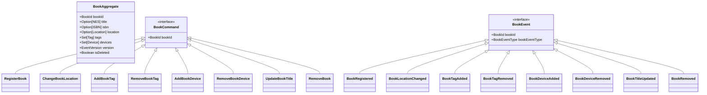
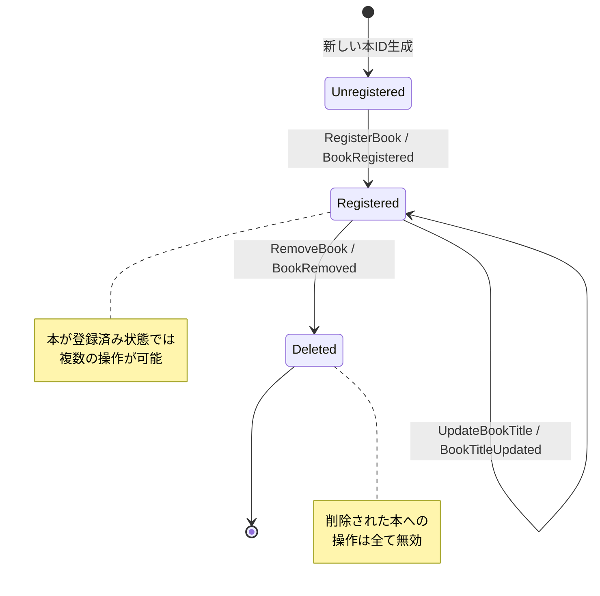
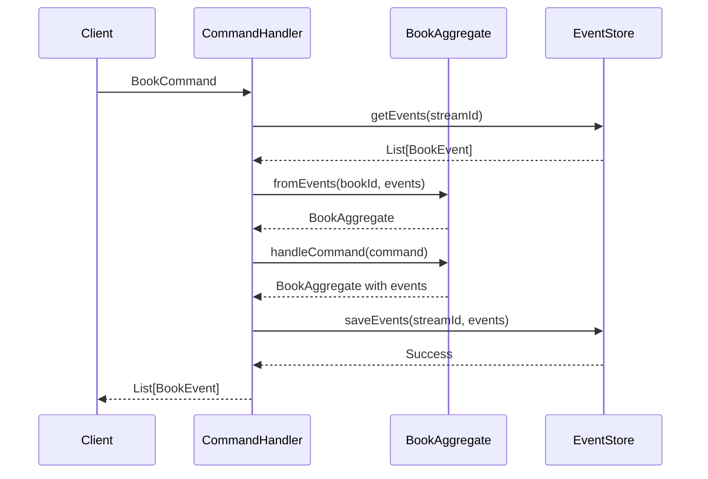
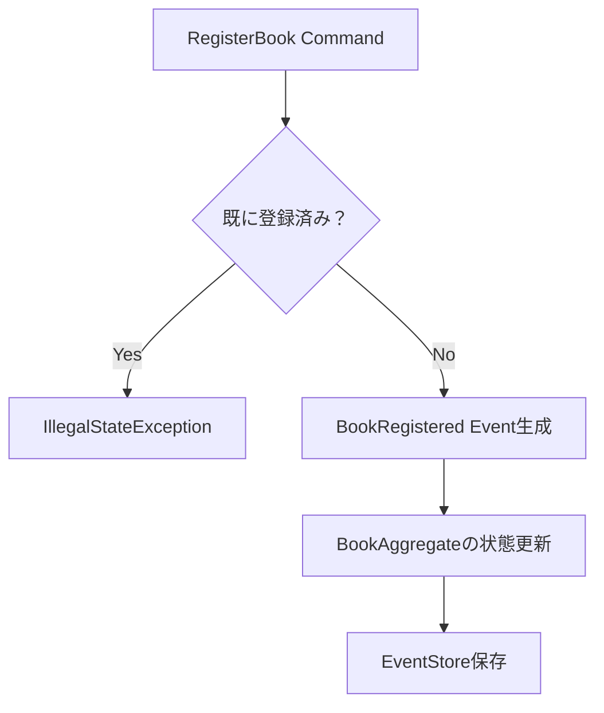
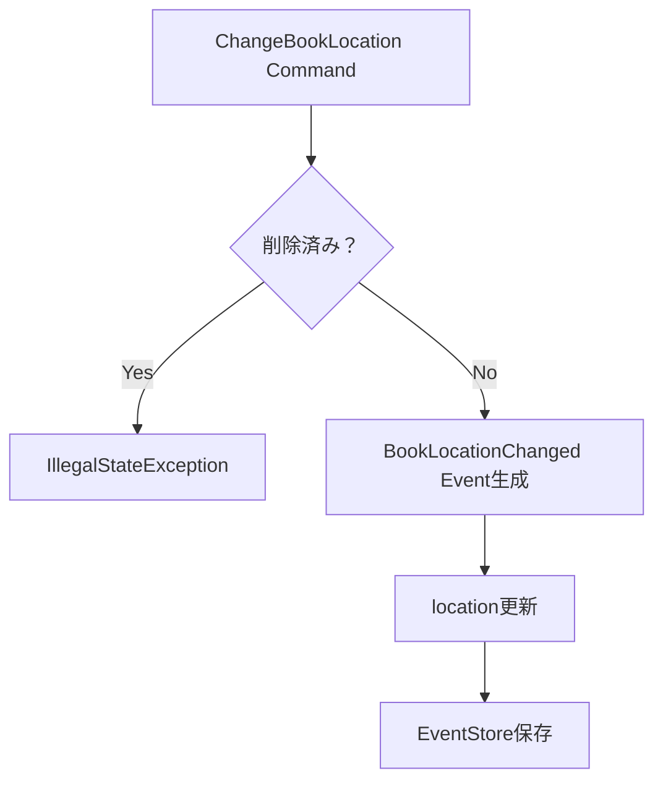
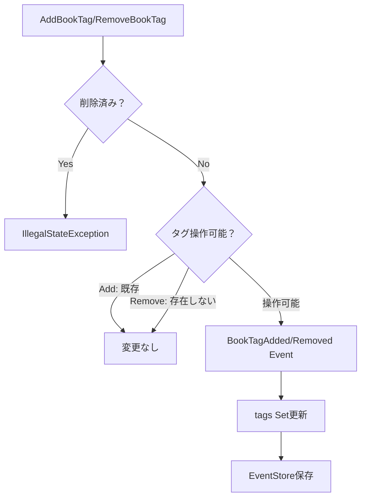
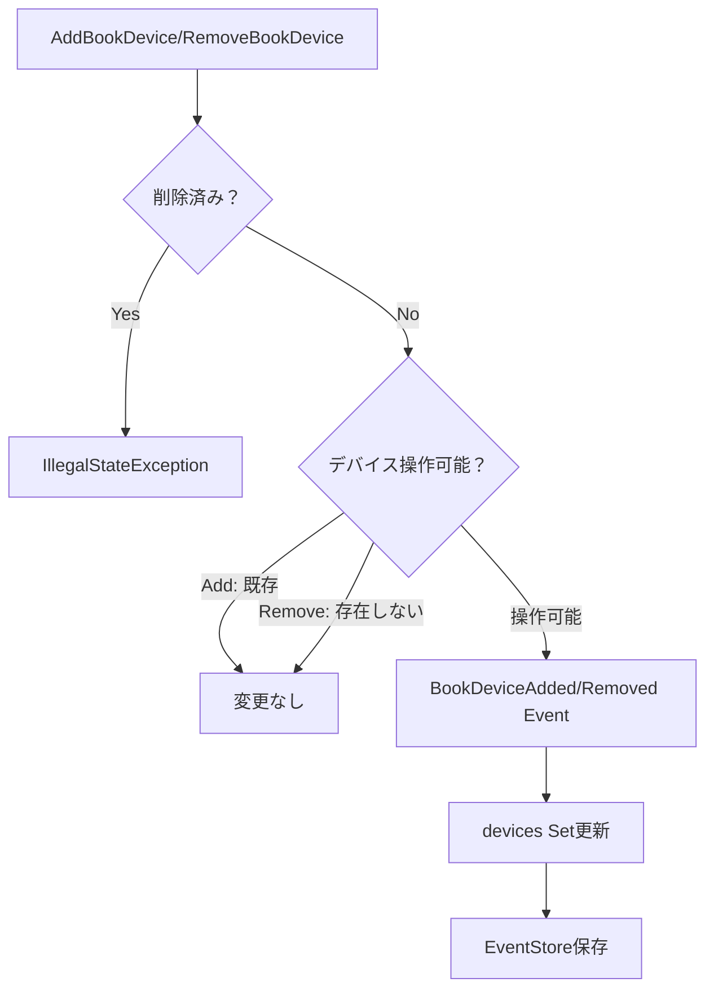
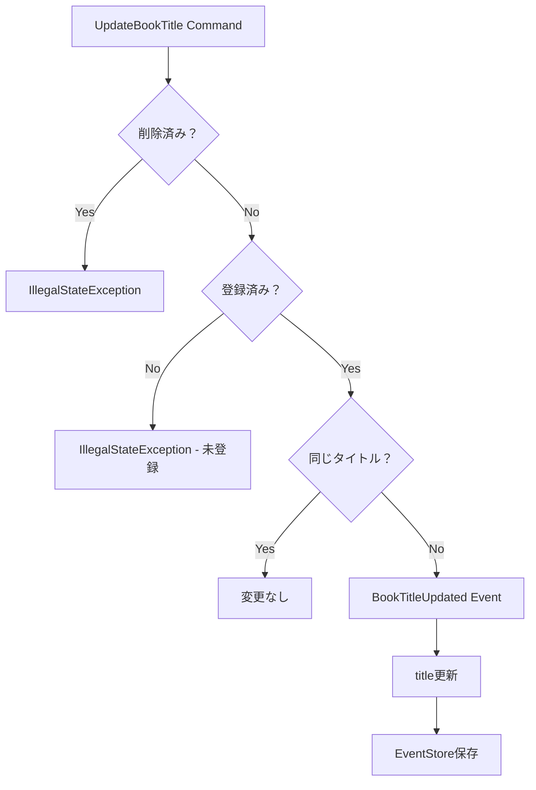
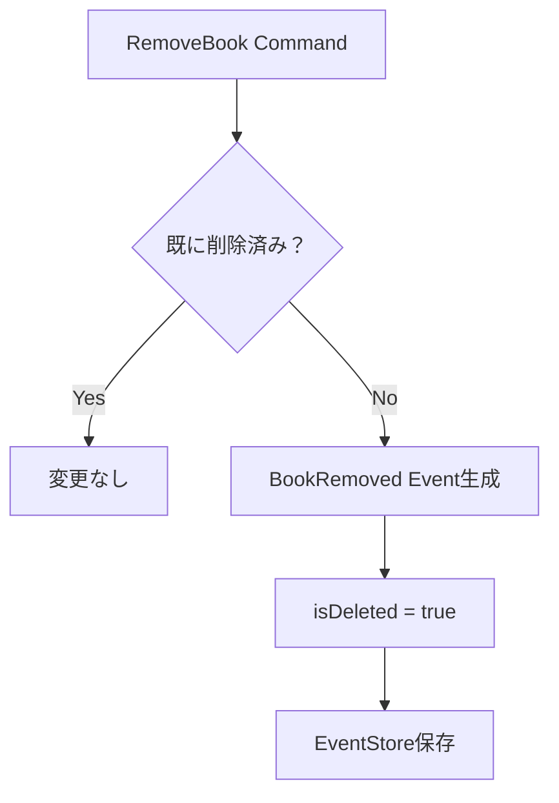

# HandyBookshelf 業務フロー

このドキュメントでは、HandyBookshelfアプリケーションの業務フローをドメインイベントとコマンドに基づいて説明します。

## 概要

HandyBookshelfは本の管理システムで、以下の主要な操作をサポートしています：
- 本の登録・削除
- 場所の変更
- タグの追加・削除
- デバイスの追加・削除
- タイトルの更新

## ドメインモデル構造

## 業務フロー全体図

## コマンド・イベントフロー

## 各操作の詳細フロー

### 1. 本の登録

### 2. 場所変更

### 3. タグ管理

### 4. デバイス管理

### 5. タイトル更新

### 6. 本の削除

## イベントソーシングパターン

本システムはイベントソーシングパターンを採用しており、以下の流れで動作します：

1. **コマンド受信**: クライアントからのコマンドを受信
2. **イベント復元**: EventStoreから過去のイベントを取得してアグリゲートを復元
3. **ビジネスロジック実行**: コマンドに基づいてビジネスルールを適用
4. **イベント生成**: 新しいドメインイベントを生成
5. **イベント永続化**: EventStoreにイベントを保存
6. **アグリゲート更新**: 新しいイベントでアグリゲートの状態を更新

このパターンにより、すべての変更履歴が保持され、システムの状態を任意の時点に復元することが可能です。

## ビジネスルール

- 未登録の本に対する操作（場所変更、タグ追加等）は不可
- 削除済みの本に対するあらゆる操作は不可
- 既に存在するタグ・デバイスの重複追加は無視
- 存在しないタグ・デバイスの削除は無視
- 同じタイトルへの更新は無視