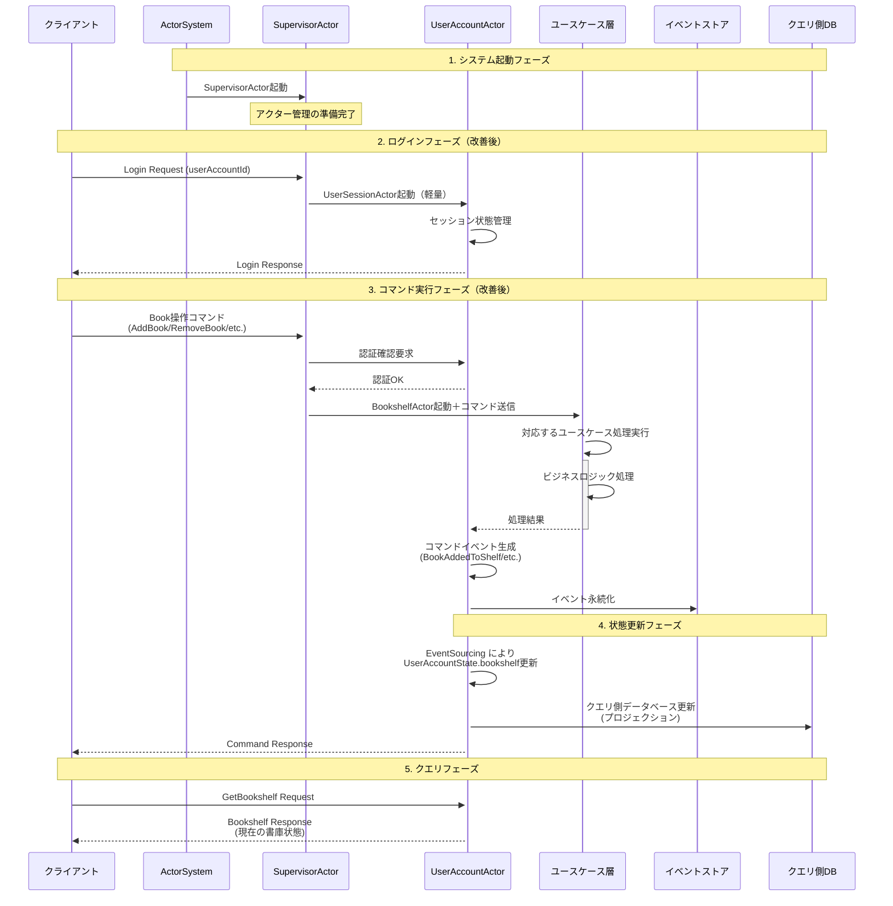
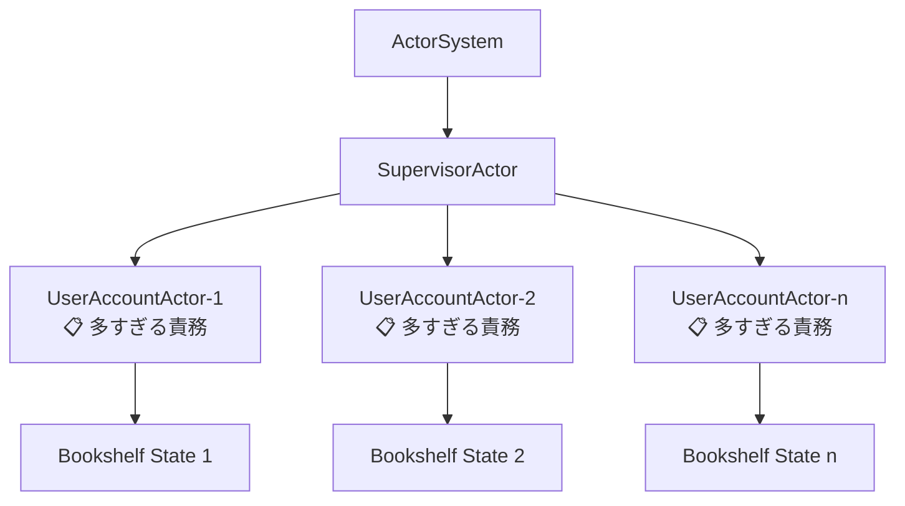
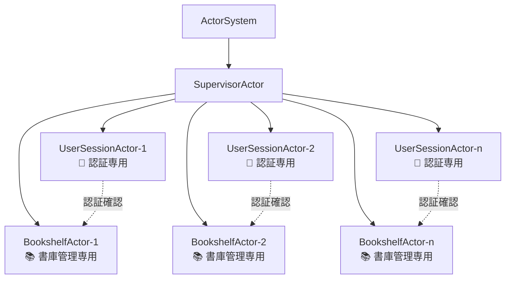
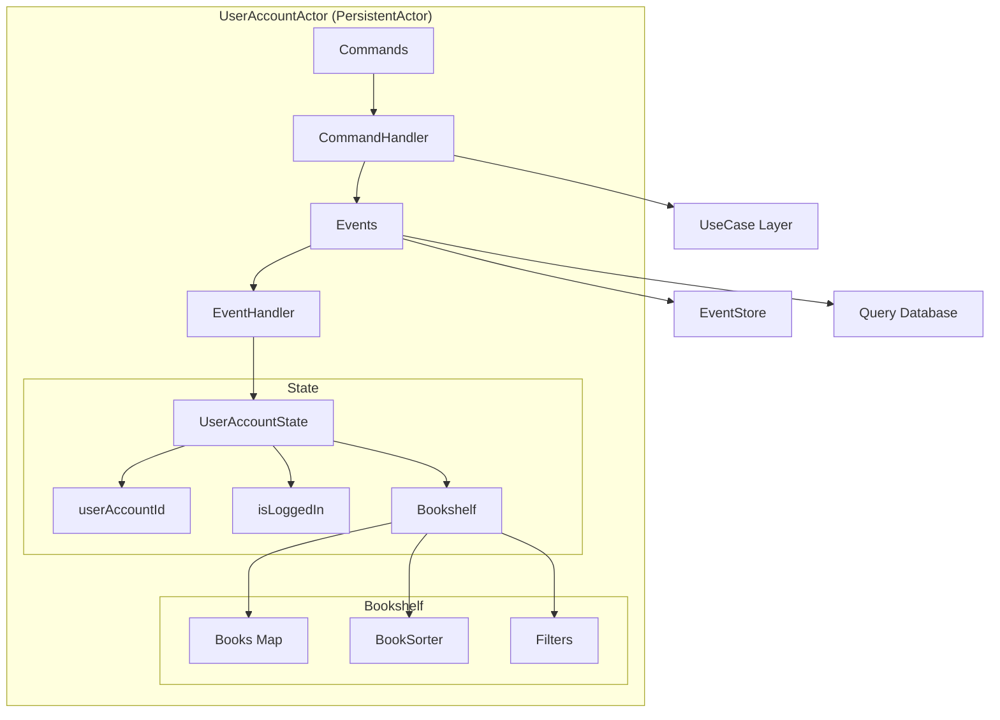
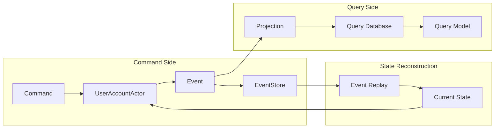
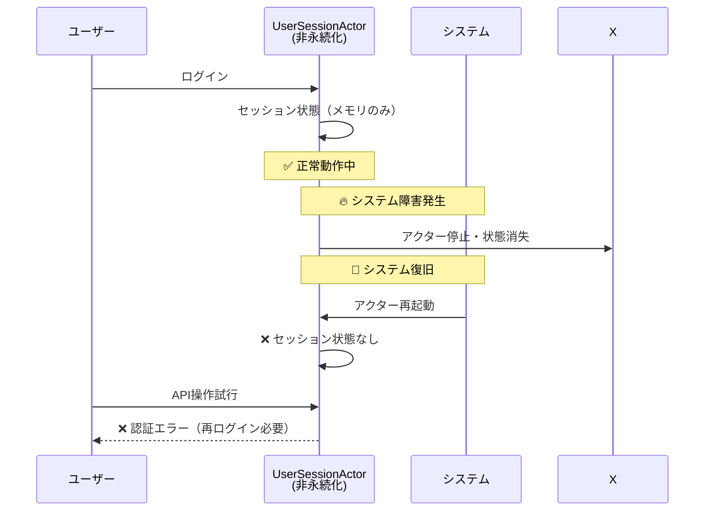
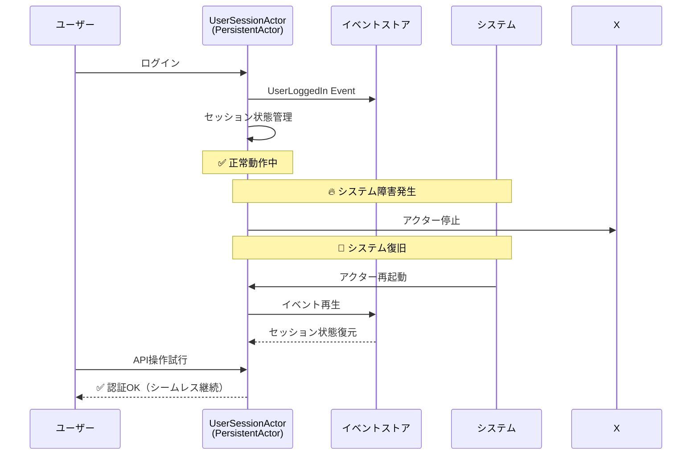

# HandyBookshelf システムアーキテクチャ

## システム処理フロー

以下は、HandyBookshelfシステムの主要な処理フローを示したアーキテクチャ図です。



## アーキテクチャコンポーネント

### 1. 現在のActorSystem層（問題のある設計）


### 2. 改善後のActorSystem層（責務分離）


### 2. UserAccountActor 詳細構造



### 3. イベントソーシングフロー



## 主要コンポーネントの責務

### SupervisorActor
- UserAccountActorの生成・管理
- アクターライフサイクル監視
- システム全体の監督

### 責務分離の改善案

#### 現在の問題
UserAccountActorが以下の複数責務を持ち、SRPに違反：
- ユーザー認証・セッション管理
- 書庫管理（Bookshelf操作）
- イベントソーシング永続化

#### 改善後のアクター設計

**UserSessionActor** (PersistentActor) 
- ⚠️ **重要**: セッション管理も永続化が必要
- ユーザー認証・ログイン状態管理
- セッション有効期限管理
- 他アクターへの認証情報提供
- 障害復旧時のセッション状態復元

**BookshelfActor** (PersistentActor)
- 書庫管理専用の永続化アクター
- 書籍の追加・削除・整理
- イベントソーシングによる状態管理
- ユーザー認証はUserSessionActorに委譲

### Bookshelf (ドメインエンティティ)
- 書籍コレクション管理
- フィルタリング・ソート機能
- 不変オブジェクトとして状態管理

### イベントストア
- 全ての状態変更イベントを永続化
- Event Replayによる状態復元
- 監査ログとしての機能

### クエリ側データベース
- 読み取り最適化されたデータ構造
- プロジェクションによる非正規化
- 高速クエリ応答

## 技術スタック

- **Actor Framework**: Apache Pekko (旧Akka)
- **Persistence**: Pekko Persistence (Event Sourcing)
- **Effect System**: Atnos Eff
- **Type Safety**: Scala 3 + Iron constraints
- **JSON Serialization**: Circe
- **HTTP API**: HTTP4s + Tapir

## イベント型一覧

### UserAccount Events
- `UserLoggedIn`: ユーザーログイン
- `UserLoggedOut`: ユーザーログアウト
- `BookAddedToShelf`: 書籍追加
- `BookRemovedFromShelf`: 書籍削除
- `SorterChanged`: ソート方法変更

### コマンド型一覧

### UserAccount Commands
- `LoginUser`: ユーザーログイン
- `LogoutUser`: ユーザーログアウト
- `AddBookToShelf`: 書籍をShelfに追加
- `RemoveBookFromShelf`: 書籍をShelfから削除
- `GetBookshelf`: 現在のBookshelf状態取得
- `ChangeSorter`: ソート方法変更
- `Shutdown`: アクター終了

## 障害復旧とセッション管理

### セッション永続化の重要性

#### 問題：非永続化セッションの場合


#### 解決：永続化セッション


### セッション管理イベント設計

```scala
// UserSessionActor Events
sealed trait UserSessionEvent
case class UserLoggedIn(userAccountId: UserAccountId, sessionId: String, loginTime: Instant) extends UserSessionEvent
case class UserLoggedOut(userAccountId: UserAccountId, sessionId: String, logoutTime: Instant) extends UserSessionEvent
case class SessionExtended(sessionId: String, newExpirationTime: Instant) extends UserSessionEvent
case class SessionExpired(sessionId: String, expiredTime: Instant) extends UserSessionEvent

// UserSessionActor State
case class UserSessionState(
  userAccountId: UserAccountId,
  sessionId: Option[String] = None,
  isLoggedIn: Boolean = false,
  loginTime: Option[Instant] = None,
  lastActivity: Option[Instant] = None,
  expirationTime: Option[Instant] = None
)
```

### 障害復旧戦略

1. **自動復旧**: アクター再起動時にイベント再生で状態復元
2. **セッション有効期限**: 古いセッションの自動無効化
3. **ハートビート**: 定期的なセッション延長メカニズム
4. **冪等性**: 同じセッションIDでの重複ログインを適切に処理

### 改善されたアーキテクチャの利点

✅ **障害耐性**: システム障害後もセッション状態を保持  
✅ **ユーザビリティ**: 再ログイン不要でシームレス継続  
✅ **監査性**: 全てのセッション活動が記録される  
✅ **セキュリティ**: セッション有効期限の厳密な管理  

このアーキテクチャにより、スケーラブルで可監査性、障害耐性の高い書庫管理システムが実現されています。